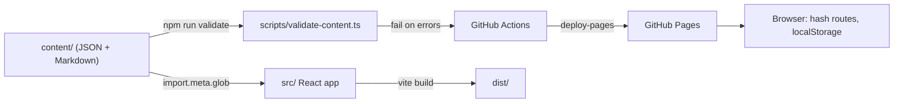

# CS 646 Study Hub

A shareable, data-driven study site for **UAB CS 646 / CS 746 Blockchain & Cryptocurrency (Fall 2026)**:
study guides with diagrams, a searchable lexicon, flashcards, a printable predicted quiz and a
practice quiz that mimics the real one (20 questions, 10 minutes, one question per screen).

Live site: https://astrachan163.github.io/cs646-study-hub/ (after publishing; see `PUBLISHING.md`).

- Add a quiz or test: **`CONTENT-GUIDE.md`** (step by step, no terminal experience assumed).
- Publish for the first time: **`PUBLISHING.md`**.

## What is inside

| Page | What it does |
|---|---|
| Home | Course facts, countdown to the next assessment, unit cards with your best practice score, course calendar |
| Unit overview | Tool cards, scope notes, sources, practice history with "retake" and "retry missed" |
| Study Guide | One Markdown page per chapter with Mermaid diagrams, table of contents, terms of the chapter |
| Cross-Reference | Lecture ↔ book tables and "not in the notes but likely on the quiz" |
| Lexicon | Searchable definitions, filter by chapter and coverage, related-term chips |
| Flashcards | Term ↔ definition, flip, spaced shuffle (known cards drift back, missed cards return soon) |
| Practice Quiz | Weighted random selection (high likelihood ×4), timer with auto-submit, instant or end-of-quiz feedback, results with explanations, retry missed only, shareable links with a seed |
| Likely Quiz | The predicted questions in order, show/hide answers, print stylesheet |
| Question Bank | Filter and search every question; "practice these" jumps into a quiz |

Progress (attempts, flashcard knowledge, chapters read) is stored in the browser's `localStorage`;
there is no login and no server.

## How content and code are separated

```
content/                       plain data, edited by content authors
  courses/<course>.json        course facts and calendar
  units/<unit-id>/             one folder per quiz or test
    unit.json  chapters/chNN.md  cross-reference.md  lexicon.json  questions.json  likely-quiz.json
templates/unit-template/       a small complete unit to copy
src/                           React + TypeScript app; discovers units by folder at build time
scripts/validate-content.ts    validator run by CI and by `npm run validate`
.github/workflows/deploy.yml   validate → lint → typecheck → test → build → deploy to GitHub Pages
```

Dropping a new folder into `content/units/` is all that is required; the app finds it through
`import.meta.glob` when it is built. The validator refuses bad ids, out-of-range answers, unknown
enum values and predicted-quiz ids that do not exist, so broken content never reaches the live site.

## Architecture in one picture



Stack: Vite, React 19, TypeScript (strict), `react-markdown` + `remark-gfm`, lazily loaded Mermaid,
Vitest, oxlint. No backend, no CSS framework, no state library.

## Developer quick start

Requires Node.js 20 or newer (22 recommended; see `.nvmrc`). All commands run in the project root.

```bash
npm ci               # install exact dependencies
npm run dev          # local dev server with live reload
npm run validate     # check content files, exit code 1 on errors
npm run check        # validate + lint + typecheck + unit tests (what CI runs before building)
npm run build        # production build into dist/ (set BASE_PATH=/repo-name/ for GitHub Pages)
npm run preview      # serve dist/ locally
```

Quiz logic (`src/lib/`) is framework-free and unit-tested: seeded randomness (`random.ts`),
filters and weighted sampling (`select.ts`), grading (`score.ts`), URL configuration
(`quizConfig.ts`), spaced flashcards (`spaced.ts`) and the content validator (`validate.ts`).

## Content credits

Course: Dr. Yuliang Zheng, UAB, Fall 2026. Textbook: *Mastering Bitcoin*, 3rd ed.
(Antonopoulos & Harding), free online at https://github.com/bitcoinbook/bitcoinbook.
Study material in `content/` is written by classmates for classmates; corrections welcome via pull request.
