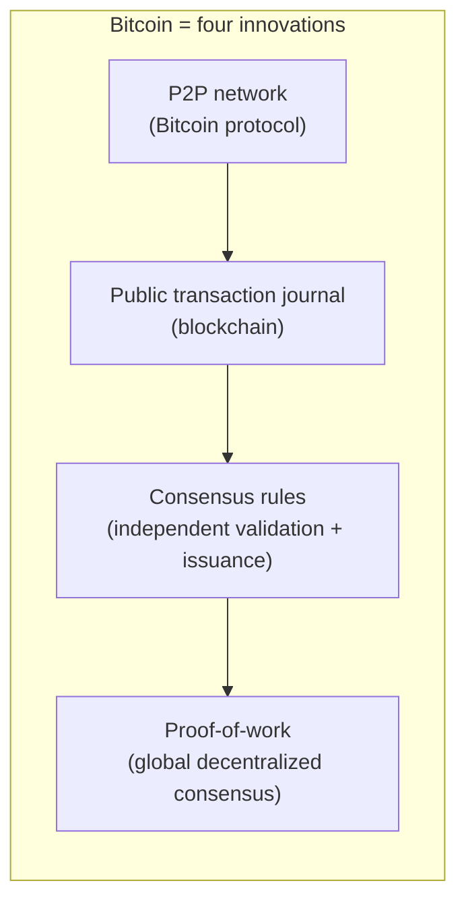
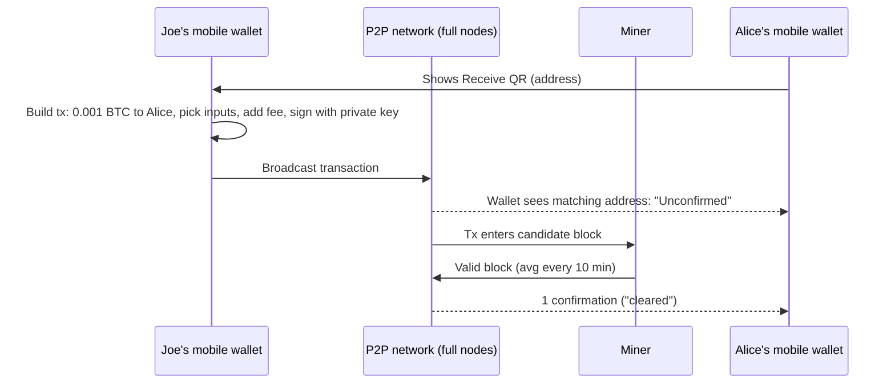

# Chapter 1: Introduction (Mastering Bitcoin, 3rd ed., `ch01_intro.adoc`)

Scope: what Bitcoin is, why it exists, brief history, wallet types, first steps (Alice buys 0.001 BTC from Joe). Pairs naturally with the Nakamoto whitepaper abstract/intro (Appendix A of the book).

**Lecture overlap (what Dr. Zheng covered from this chapter):** W1 s2 timeline (1982 Chaum, 2008 Nakamoto, 'refers to Hashcash'); W1 s16 'What is Bitcoin?' (asset, digital cash, digital gold, anonymous payment system, blockchain, distributed consensus protocol); W3 double-spending techniques and Chaum's drawbacks (needs banks); W4 s3-6 combined public ledger (only transactions recorded, no balances, accounts created on the fly), the five questions (link account, claim, spend, double spend, minting); W4 s10-13 10-minute clock, consensus committee = miners, Bitcoin Core; W4 s15-16, s36 P2P hard to shut down; W4 s37-40 full node vs SPV. Not covered in class: wallet-type categories, recovery-code details, irreversibility/KYC, price discovery, Byzantine Generals.

## Section by section: the claims a quiz can test

### Introduction (opening, untitled)
- **Bitcoin is "a collection of concepts and technologies that form the basis of a digital money ecosystem."** Units of currency are called bitcoin (small b); the system/protocol/network is Bitcoin (capital B).
- Bitcoin is **entirely virtual**: no physical coins and no individual digital coins; "the coins are implied in transactions that transfer value from spender to receiver."
- Users control **keys** that prove ownership; signing with the key is "the only prerequisite to spending bitcoin". Keys are usually stored in a digital wallet.
- **Distributed, peer-to-peer: no central server or point of control.**
- **Mining**: new bitcoins are created by repeatedly performing a computational task that references a list of recent transactions; any participant may mine; on average **every 10 minutes** one miner adds security to past transactions and is rewarded with **new bitcoins plus fees**. Mining "decentralizes the currency-issuance and clearing functions of a central bank."
- **Difficulty adjusts dynamically** so someone succeeds every 10 minutes on average regardless of total hashing power.
- **Issuance decreases periodically**; total fixed "just below **21 million**"; half the remaining coins are added every **four years** (halving); ~99% of all bitcoins issued by about **block 1,411,200 (~2035)**; long-term the currency is **deflationary**; "nobody can force you to accept any bitcoins created beyond the expected issuance rate."
- **Four key innovations** that make up Bitcoin (a classic exam list):
  1. A decentralized peer-to-peer network (the Bitcoin protocol)
  2. A public transaction journal (the blockchain)
  3. A set of rules for independent transaction validation and currency issuance (consensus rules)
  4. A mechanism for reaching global decentralized consensus on the valid blockchain (the proof-of-work algorithm)
- Author's metaphor: Bitcoin is "the internet of money".

### Sidebar: Digital Currencies Before Bitcoin
- Three questions anyone accepting digital money must answer: is it **authentic (not counterfeit)**, can it be **spent only once (double-spend problem)**, can **nobody else claim it**.
- Physical cash solves double-spend trivially (a note can't be in two places). Digital money historically solved counterfeiting/double-spend with a **central clearinghouse**.
- Cryptographic **digital signatures** let a user prove ownership of a digital asset and, with the right architecture, address double-spend.
- Pre-Bitcoin digital currencies (late 1980s on) were **centralized**, often backed by national currency or gold, and were **litigated out of existence or collapsed** -> a *decentralized* design was needed to remove the single point of attack.

### History of Bitcoin
- **2008**: paper "Bitcoin: A Peer-to-Peer Electronic Cash System" by the alias **Satoshi Nakamoto**.
- Nakamoto combined prior inventions, explicitly **digital signatures and Hashcash**, into a fully decentralized e-cash system with no central authority for **issuance or settlement/validation**.
- Key innovation: **proof-of-work** used as a distributed computation to run "a global lottery every 10 minutes on average" so the network reaches **consensus** on transaction state; this solves **double-spend** without a clearinghouse.
- **2009**: network starts from Nakamoto's reference implementation.
- Mining power has grown exponentially and exceeds the world's top supercomputers combined.
- Nakamoto **withdrew in April 2011**; identity still unknown; **nobody controls Bitcoin** individually.
- Sidebar **"A Solution to a Distributed Computing Problem"**: Bitcoin is a practical solution to the **Byzantine Generals' Problem** (leaderless participants agreeing over an unreliable, possibly compromised network) using PoW **without a central trusted authority**.

### Getting Started
- A **wallet is the most common user interface** to Bitcoin, analogous to a web browser for HTTP; many brands, varying in quality/security/privacy.
- **Bitcoin Core** is the **reference implementation** (includes a wallet), derived from Satoshi's original code.

#### Choosing a Bitcoin Wallet -> Types of Bitcoin wallets (by platform)
- **Desktop wallet**: first type created (reference implementation); autonomy and control, but general-purpose OSes are often insecure.
- **Mobile wallet**: **most common type**; good for new users; most fetch data from remote servers, which **reduces privacy** by disclosing addresses/balances to third parties.
- **Web wallet**: accessed via browser, wallet stored on a **third-party server** (like webmail); some keep keys client-side, **most take control of the keys** in exchange for ease of use; don't store large amounts there.
- **Hardware signing devices**: special-purpose hardware/firmware that stores keys and signs; connects via USB, NFC, or QR/camera; "sometimes called hardware wallets" but **must be paired with a full-featured wallet** to send/receive, and the paired wallet's security/privacy matters.

#### Full node versus Lightweight (by autonomy / network interaction)
- **Full node**: validates the **entire history** of Bitcoin transactions; may store and serve data to others; uses substantial resources (about the same as streaming an hour of video per day of transactions); offers **complete autonomy**.
- **Lightweight client = simplified-payment-verification (SPV) client**: connects to a full node/remote server, **stores the wallet locally**, **partially validates**, independently creates outgoing transactions.
- **Third-party API client**: interacts through a third party's API rather than the network; trusts the remote server for accurate data and privacy.
- TIP: **full nodes are the peers**; lightweight wallets and other software are **clients** that depend on peers; a client's security "ultimately relies on the integrity of its peers."

#### Who controls the keys
- Access to bitcoins is controlled by **private keys** ("like very long PINs").
- Two categories: **wallets** (you control the keys) vs **accounts with custodians** (third party controls keys). Andreas's slogan: **"Your keys, your coins. Not your keys, not your coins."**
- Three most common combos: desktop full node (you hold keys), mobile lightweight wallet (you hold keys), web-based third-party accounts (you don't).

#### Quick Start
- Alice (non-technical) installs a **mobile wallet** recommended by Joe; chooses **noncustodial** wallet so only she controls keys and **she bears responsibility for backup**; wallet produces a **recovery code**.

#### Recovery Codes
- Most modern noncustodial wallets provide a **recovery code** (numbers, letters, or words chosen **randomly by the software**) that is the **basis for all keys the wallet generates**. Examples: BlueWallet and Electrum give 12 words; Muun gives a block of letters/digits.
- Alternative names: **"mnemonic"/"mnemonic phrase"** (implies memorizing, but writing it down is more reliable) and **"seed phrase"** (it seeds the key-generation function).
- Recovery restores all **onchain** transactions but **not metadata** such as labels; some wallets offer an extra backup for that.
- **Offchain** payments (e.g., not every payment stored in the blockchain) mean a recovery code alone can't guarantee recovering all funds -> back up the wallet database frequently.
- WARNING: legit wallets ask for the recovery code only at **initial setup** and **recovery**; malware "wallets" that ask at other times are **phishing**.

#### Bitcoin Addresses
- The wallet **randomly generates a private key** and derives addresses from it. Addresses are **not registered** anywhere; they are simply numbers corresponding to the key, generated independently by the wallet.
- TIP: addresses/invoices can be shared safely: unlike a bank account number, knowing your address does **not** let anyone withdraw; but **address reuse leaks privacy** (two payers to the same address can see each other's payments) -> **generate a new address/invoice for each payment**.

#### Receiving Bitcoin
- "Receive" shows a **QR code** encoding the address.

#### Getting Your First Bitcoin
- **Bitcoin transactions are irreversible**; card/PayPal/bank payments are reversible, so sellers of bitcoin demand identity verification -> new users can't instantly buy with a credit card.
- Ways to acquire: buy from a friend, **earn** it by selling goods/services, **Bitcoin ATM**, **currency exchange** linked to a bank account.
- Privacy TIP: Bitcoin itself needs no PII, but where it touches traditional systems (exchanges) **KYC/regulations** apply; once an address is tied to an identity, associated transactions (even earlier ones) can be tracked, so many keep exchange accounts separate from wallets.

#### Finding the Current Price of Bitcoin
- **Price is set by markets**; bitcoin has a **floating exchange rate** (supply and demand); price differs per market and fluctuates many times per second; pricing services compute a **volume-weighted average** (e.g., BTC/USD). Sites: Bitcoin Average, CoinCap, CME Bitcoin Reference Rate.

#### Sending and Receiving Bitcoin
- Alice buys **0.001 BTC** = **1 millibitcoin (mBTC)** = **100,000 satoshis (sats)**.
- Joe scans Alice's QR code, enters the amount, optionally a label and a **fee (rate)**; **higher fee -> faster confirmation**.
- Joe's wallet **constructs** a transaction assigning 0.001 BTC to Alice's address, **sources funds** from his wallet, **signs** with his private keys, and transmits it over the **peer-to-peer protocol**; within seconds most well-connected nodes have it.
- Alice's wallet is constantly listening for transactions matching its addresses and shows an incoming 0.001 BTC.
- Sidebar **Confirmations**: the transaction first shows as **"Unconfirmed"** = propagated but not yet recorded in the blockchain; to be confirmed it must be **included in a block** (every ~10 min); in traditional finance this is **clearing**.

## Key terms

| Term | Definition |
|---|---|
| Bitcoin / bitcoin | Capital-B: the system, protocol, network. Small-b: the unit of currency. |
| Blockchain | The public transaction journal; a chain of blocks back to the genesis block. |
| Consensus rules | Rules every node applies independently to validate transactions and currency issuance. |
| Proof of work (PoW) | Mechanism/algorithm for reaching global decentralized consensus on the valid chain; a computational lottery won on average every 10 minutes. |
| Mining | Repeatedly performing the PoW computation referencing recent transactions; the winner is rewarded with new bitcoins plus fees. |
| Double-spend problem | Risk that the same digital money unit is spent twice; pre-Bitcoin solved by a central clearinghouse; Bitcoin solves it with PoW consensus. |
| Byzantine Generals' Problem | Leaderless participants agreeing on a course of action over an unreliable/compromised network; Bitcoin is a practical solution. |
| Satoshi Nakamoto | Pseudonymous author of the 2008 paper and 2009 reference implementation; withdrew April 2011; identity unknown. |
| Hashcash | Adam Back's proof-of-work scheme that Nakamoto combined with digital signatures. |
| Wallet | The most common user interface to Bitcoin; software that manages keys; "wallet" (you control keys) vs custodian account (they do). |
| Bitcoin Core | The reference implementation of the protocol, derived from Satoshi's original; includes a wallet. |
| Desktop / mobile / web wallet | Wallet categories by platform; mobile is the most common; web wallets store the wallet on a third-party server. |
| Hardware signing device | Special-purpose device that stores keys and signs; a.k.a. "hardware wallet", but needs a paired full-featured wallet. |
| Full node | Program that validates the entire transaction history; the network's *peers*. |
| Lightweight (SPV) client | Connects to full nodes, stores wallet locally, partially validates; a *client* dependent on peers. |
| Third-party API client | Talks to Bitcoin only through a third party's API; trusts that party. |
| Custodial vs noncustodial | Whether a third party or the user controls the private keys. |
| Private key | Secret number ("very long PIN") that controls access to bitcoins. |
| Recovery code | Randomly generated words/characters from which all wallet keys derive; a.k.a. mnemonic (phrase) or seed phrase. |
| Offchain | Payments not recorded in the public blockchain (cheaper, more private) so seed-based recovery can't restore them. |
| Address | A number derived from the key, generated independently by the wallet, not registered anywhere; safe to share; reuse hurts privacy. |
| Invoice | A payment request that may contain address, amount, description (see BIP21 URI in ch02). |
| QR code | 2-D barcode used to share addresses/invoices between phones. |
| Irreversibility | Bitcoin payments cannot be reversed, unlike cards/PayPal/bank transfers. |
| Floating exchange rate | Price set by supply and demand in markets, not by any authority. |
| Millibitcoin (mBTC), satoshi (sat) | 0.001 BTC; 0.00000001 BTC (1 BTC = 100,000,000 sats). |
| Unconfirmed / confirmation / clearing | Propagated but not in a block / included in a block / the traditional-finance term for confirmation. |
| Deflationary | Because issuance diminishes to a fixed cap, over the long term the currency is deflationary. |

## Quizzable facts (numeric or calculation items are marked LOW)

1. Bitcoin is virtual: coins are "implied in transactions"; there are no digital coin files.
2. Possession of the private key that can sign is the **only** prerequisite to spending.
3. No central server or point of control; P2P.
4. New bitcoins are created by mining; miner reward = new bitcoins + transaction fees.
5. One block roughly every **10 minutes on average**; difficulty adjusts to keep it so regardless of miner count.
6. Cap: just under **21 million** bitcoins.
7. Issuance halves every **four years**; ~99% issued by ~2035 (block ~1,411,200) [LOW: numeric detail].
8. Long term, Bitcoin is **deflationary**.
9. The **four components**: P2P network (protocol), blockchain (public journal), consensus rules, PoW consensus mechanism.
10. Bitcoin = "internet of money" (Antonopoulos).
11. Three trust questions for digital money: authenticity, single-spend (double-spend problem), exclusive ownership claim.
12. Physical cash beats double-spend because a note can't be in two places; digital money used a **central clearinghouse**.
13. Earlier digital currencies were centralized -> attacked/litigated -> Bitcoin is decentralized "by design".
14. Whitepaper **2008**; network **2009**; Nakamoto left **April 2011**.
15. Nakamoto's combined prior inventions: **digital signatures + Hashcash** (PoW).
16. PoW as a "global lottery every 10 minutes" -> consensus -> solves double-spend without a clearinghouse.
17. Bitcoin solves the **Byzantine Generals' Problem** without a central trusted authority.
18. Wallet : Bitcoin protocol :: browser : HTTP.
19. Bitcoin Core = reference implementation, includes a wallet.
20. Wallet platform types: desktop (first, reference impl), mobile (most common), web (third-party server, like webmail), hardware signing devices (need a paired wallet).
21. Mobile wallets often query remote servers -> privacy loss.
22. Full node validates **all** history; SPV/lightweight client partially validates and depends on a full node; third-party API client trusts a provider.
23. Full nodes are **peers**; light wallets are **clients**; a client's security relies on its peers.
24. "Your keys, your coins. Not your keys, not your coins."
25. Noncustodial wallet => user is responsible for backup.
26. Recovery code = randomly chosen by software, basis of all keys; also called mnemonic/seed phrase; writing it down beats memorizing.
27. Recovery code restores onchain funds but **not labels/metadata** and can't guarantee **offchain** funds.
28. Legit wallets ask for the recovery code only at setup and at recovery; otherwise suspect phishing malware.
29. Addresses are derived from the private key and are **not registered** with any service.
30. Sharing an address is safe (no one can withdraw), but **reuse leaks privacy**; use a fresh address per payment.
31. Bitcoin transactions are **irreversible**; that's why buying bitcoin with a reversible card requires KYC delays.
32. Ways to acquire: friend, earn, Bitcoin ATM, exchange.
33. Once an address is linked to an identity, past and future transactions can be tracked.
34. Price is set by **markets** (floating rate); pricing services aggregate a **volume-weighted average**.
35. 0.001 BTC = 1 mBTC = 100,000 sats [LOW-ish: unit arithmetic, but often asked as a definition].
36. Higher fee rate -> faster confirmation.
37. The sender's wallet constructs, funds, and signs the transaction; it propagates to most nodes in **seconds**.
38. "Unconfirmed" = propagated, not yet in a block; a confirmation = inclusion in a block; confirmation is Bitcoin's version of **clearing**.
39. Hardware signing devices connect by USB, NFC, or QR camera.
40. Full node resource cost ~ an hour of streaming video per day of transactions [LOW].

## Misconceptions and traps (how distractors are built)

- "Bitcoin wallets store bitcoins." No: wallets store **keys**; coins exist only as transaction records on the blockchain (reinforced in ch05).
- "Addresses must be registered with the network." No: generated offline and independently.
- "Someone who knows my address can take my funds." No: only the private key spends.
- "Satoshi Nakamoto controls Bitcoin / Bitcoin Core." No: nobody exerts individual control.
- "Bitcoin has a fixed price / the Bitcoin Foundation sets the price." No: floating market rate.
- "Bitcoin transactions can be reversed like a card chargeback." No: irreversible.
- "The 21 million cap is enforced by a central authority." No: consensus rules enforced by every node.
- "Mining creates coins from nothing without limit." No: issuance schedule halves every 4 years toward the cap.
- "Blocks arrive exactly every 10 minutes." No: **on average**; difficulty retargets to hold the average.
- "A hardware wallet is a complete wallet." No: it's a signing device that needs a paired wallet.
- "SPV clients fully validate transactions." No: they partially validate and rely on peers.
- "Web wallets always keep keys client-side." Most take control of keys.
- "Recovery codes restore everything." Not labels, not offchain funds.
- "A recovery code should be memorized (it's a 'mnemonic')." Book says write it down.
- "Bitcoin is inflationary because miners keep creating coins." Book: long-term **deflationary**.
- Distractor for "which is NOT one of the four innovations": smart contracts, Turing-complete scripting, a central mint, proof of stake.
- Distractor for Nakamoto's building blocks: "public-key encryption and Merkle trees" vs the book's "digital signatures and Hashcash".
- Distractor dates: 2008 paper vs 2009 launch vs 2011 departure.

## Diagrams: Bitcoin's four building blocks and the Alice/Joe flow

## Whitepaper tie-ins for this chapter (Appendix A)
- Abstract: "purely peer-to-peer version of electronic cash"; digital signatures are "part of the solution"; the network **timestamps transactions by hashing them into an ongoing chain of hash-based proof-of-work**; the **longest chain** is proof of the sequence of events and came from the largest pool of CPU power; secure as long as honest nodes control a **majority of CPU power**.
- Intro: trusted third parties make **non-reversible transactions impossible**, raise costs, and cut off micropayments; solution is "cryptographic proof instead of trust"; a "peer-to-peer distributed **timestamp server**".
- Section 2: an electronic coin is "a **chain of digital signatures**" (each owner signs a hash of the previous transaction and the next owner's public key).
- Section 6: the first transaction in a block creates a new coin for the block creator (incentive, like gold mining); fees = inputs minus outputs; when issuance ends, incentive can be fees only.
- Section 10 privacy: keep public keys anonymous; **use a new key pair for each transaction**.

---

_Source: Mastering Bitcoin, 3rd edition, chapter 1 (github.com/bitcoinbook/bitcoinbook, `develop` branch). Lecture citations `W4 s18` = week-4 slide 18. Full lecture-vs-book analysis: the Cross-Reference page._
