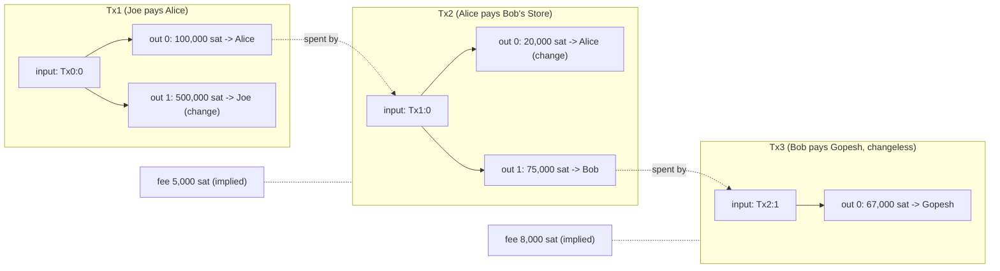
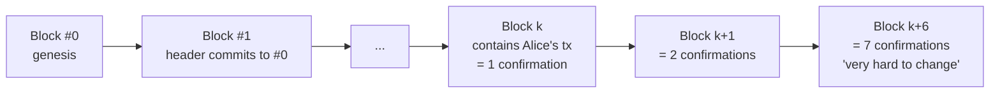
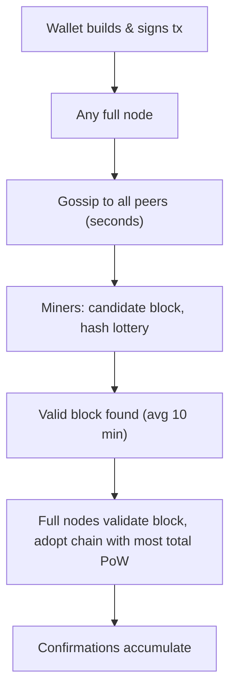

---
cursor:
  subagentId: "bc-8bc683e0-09f0-519a-ab41-a1865009aa67"
---

# Chapter 2: How Bitcoin Works (Mastering Bitcoin, 3rd ed., `ch02_overview.adoc`)

Scope: one transaction (Alice buys a podcast episode from Bob's online store) followed from wallet -> network -> block -> confirmations -> Bob spends it. This is the highest-yield chapter for a conceptual quiz because it defines transactions, inputs/outputs, UTXOs, change, fees, propagation, mining, PoW, confirmations, and the best-chain rule in plain language.

## (a) Section-by-section outline with the claims a professor would test

### Opening + Bitcoin Overview
- Bitcoin "does not require trust in third parties"; each user's own software can verify every aspect of the system.
- System = **users with wallets containing keys**, **transactions propagated across the network**, and **miners who produce (through competitive computation) the consensus blockchain**, "the authoritative journal of all transactions."
- A **blockchain explorer** is "a Bitcoin search engine" for addresses, transactions, blocks (Blockstream Explorer, Mempool.Space, BlockCypher).
- WARNING: looking up your own transactions on an explorer leaks your interest (IP, browser) to the operator -> privacy risk.

### Buying from an Online Store
- Alice buys a **premium podcast episode** from **Bob's** web store; prices in USD, payable in BTC at the prevailing rate.
- Store generates a QR code containing an **invoice**: a **BIP21 URI** `bitcoin:<address>?amount=...&label=...&message=...` with a destination address, amount, label, and description, so the wallet prefills the payment.
- Bob sees the transaction within seconds ("about the same amount of time as a credit card authorization").
- NOTE on units: fractional values from **millibitcoin (1/1000)** down to **1/100,000,000 = one satoshi**.

### Bitcoin Transactions
- "A transaction tells the network that the owner of certain bitcoins has authorized the transfer of that value to another owner." The new owner spends by creating another transaction -> **chain of ownership**.

#### Transaction Inputs and Outputs
- Transactions are like lines in a **double-entry bookkeeping ledger**: one or more **inputs** (spend funds) and one or more **outputs** (receive funds).
- Inputs and outputs need not sum equal: **outputs total slightly less than inputs; the difference is the implied transaction fee** collected by the miner who includes the transaction.
- Each input carries **proof of ownership: a digital signature** anyone can verify. "Spending is signing a transaction that transfers value from a previous transaction over to a new owner identified by a Bitcoin address."

#### Transaction Chains
- Alice's payment (Tx2) uses a **previous transaction's output as its input** (Tx1:0 = output 0 of Tx1, where Joe paid her 100,000 sats).
- The input reference is the 32-byte **txid** plus the **output index** (":0" = first position).
- **Transactions do not explicitly include the value of their inputs**; software must look up the referenced previous output.
- Tx2 has two outputs: **75,000 sats to Bob** and **20,000 sats change back to Alice** (fee 5,000 sats implied).
- TIP: serialized transactions encode value as an integer of the smallest unit; originally the nameless "base unit", later called a **satoshi**.

#### Making Change
- Inputs, like currency notes, **cannot be partly spent** -> a **change output** pays the spender back ($20 bill for a $5 item -> $15 change).
- At the protocol level **there is no difference between a change output and a payment output**.
- The **change address** need not be the input's address and for privacy is usually a **new address** from the wallet; ideally payment and change outputs are indistinguishable to third parties.
- **Changeless transactions** have only a **single output**; practical only when the input amount ~ payment + fee. Bob's Tx3 is changeless.

#### Coin Selection
- Wallets choose inputs via a **coin selection** strategy (aggregate small inputs vs use one large); like handling cash, balancing "pocket full of loose change" vs "only big bills."

#### Common Transaction Forms
- **Simple payment**: **one input, two outputs** (payment + change) -> the most common form.
- **Consolidation transaction**: **several inputs -> one output** (exchanging a pile of coins for a larger note).
- **Payment batching**: **one transaction -> many outputs/recipients** (e.g., payroll).

### Constructing a Transaction
- The wallet does everything after the user picks destination, amount, and fee.
- A wallet that knows its inputs can construct and sign a transaction **completely offline** (like writing a check at home and mailing it later).

#### Getting the Right Inputs
- Wallets track their available outputs. A **full node** wallet has a copy of **every confirmed transaction's unspent outputs = UTXOs**; lightweight clients track only their own UTXOs.
- If one UTXO is insufficient the wallet combines several ("picking coins from a purse").

#### Creating the Outputs
- An output is created with a **script** that says roughly: "paid to whoever can present a signature from the key corresponding to Bob's public address" -> Alice **encumbers** the output with a demand for Bob's signature.
- Change output created in the **same** transaction.
- The **fee is not explicitly stated**; it is implied by inputs minus outputs and collected by the miner.

### Adding the Transaction to the Blockchain
#### Transmitting the transaction
- Because the transaction is self-contained, **it doesn't matter how or where** it is transmitted. The network's purpose is to propagate transactions and blocks to all participants.

#### How it propagates
- Peers have both the logic and data to fully verify new transactions; visualized as graph nodes -> Bitcoin peers are called **"full verification nodes" / full nodes**.
- The wallet can send to **any node over any connection**, or to a relay (e.g., block explorer). Alice's wallet need not connect to Bob's.
- Any node receiving a **valid, previously unseen** transaction forwards it to all connected peers = **gossiping** -> reaches most nodes in **seconds**.

#### Bob's view
- Bob's wallet recognizes an output redeemable by his keys, verifies the transaction is well formed; with his own full node he can also verify it spends **valid UTXOs**.

### Bitcoin Mining
- The transaction becomes part of the blockchain only when **included in a block by mining** and that block is **validated by full nodes**.
- "Bitcoin's system of counterfeit protection is based on computation." Blocks have a small header that must be formed in a specific way requiring **enormous computation to produce, trivial computation to verify**.
- **Mining serves two purposes**:
  1. Miners only get honest income from blocks that follow **consensus rules** -> incentive to include only valid transactions (users may make a trust-based assumption that block transactions are valid).
  2. Mining **creates new bitcoins** in each block on a fixed, diminishing issuance schedule ("almost like a central bank printing new money").
- Reward = **new bitcoins + transaction fees**; collected only if the block is valid under consensus rules -> "security for Bitcoin without a central authority."
- Mining is a **decentralized lottery**: each miner builds a **candidate block** (its lottery ticket) and runs it through a **hash function**; same input -> same output, but output is unpredictable for any new input. If the hash matches the protocol's **template**, the miner wins; otherwise tweak the candidate and retry. As of writing, **~168 billion trillion** tries per block [LOW numeric].
- Anyone verifies a winning block by running the hash **once** -> the block is **proof of work (PoW)**.
- Transactions are added to candidate blocks **prioritized by highest fee rate** (plus other criteria).
- Each miner starts a new candidate as soon as it receives the previous block, including a **commitment to the previous block**.
- Each candidate contains a **special transaction paying the miner's own address the block reward + all fees** (the coinbase transaction, though ch02 doesn't name it). Pool miners direct the reward to a **pool address**, shared in proportion to work.
- Alice's tx was included ~**5 minutes** after broadcast; a miner announces the block; others validate it and start the next lottery.
- Inclusion in a block = **one confirmation**. Rewriting it would require redoing as much work as the whole network needs for a block.
- With competing blocks, full nodes choose the **chain of valid blocks with the most total PoW = the "best blockchain"**.
- Miner incentive analysis: colluding with Alice to reverse her payment requires creating **two** blocks for a small extra payment versus **one** honest block with all fees plus the **block subsidy** -> dishonesty is unprofitable -> Bob can rely on the payment.
- **~19 minutes later** a second block on top gives **two confirmations**; each further block is another confirmation; reversing then requires re-mining all of them plus one more.
- Chain goes back to **block #0, the genesis block**. **By convention, more than six confirmations is considered very hard to change.**

### Spending the Transaction
- Once in the blockchain the transaction is visible to all; **full nodes validate every transfer from the moment the coins were generated** through to Bob's address.
- **Lightweight clients partially verify** by confirming the transaction is in the blockchain with several blocks after it (SPV).
- Bob extends the **chain of transactions** by paying his web designer **Gopesh**; chain: Joe -> Alice -> Bob -> Gopesh.

## (b) Key terms

| Term | Definition |
|---|---|
| Transaction | Signed data structure by which the owner of bitcoins authorizes transferring that value to a new owner. |
| Input | Reference to a previous transaction output being spent (txid + output index) plus proof of ownership (signature). |
| Output | A value plus a script (encumbrance) saying who can spend it next. |
| UTXO | Unspent transaction output: an output not yet consumed as an input; the set of all UTXOs is what full nodes track. |
| Transaction fee | Implied difference between total inputs and total outputs; paid to the miner including the transaction. |
| Fee rate | Fee per unit of transaction size; miners prioritize higher fee rates. |
| txid | 32-byte transaction identifier used to reference outputs. |
| Change output / change address | Output returning excess input value to the spender, usually to a fresh address. |
| Changeless transaction | Transaction with a single output and no change. |
| Coin selection | Wallet strategy for choosing which UTXOs to spend. |
| Simple payment | One input, two outputs (payment and change): the most common form. |
| Consolidation transaction | Many inputs, one output. |
| Payment batching | One transaction paying many recipients (many outputs). |
| Encumber | To lock an output with a spending condition (e.g., requires Bob's signature). |
| Invoice / BIP21 URI | Payment request encoding address, amount, label, message; `bitcoin:` URI scheme. |
| Blockchain explorer | Web app to search addresses/transactions/blocks; privacy caveat. |
| Full (verification) node | Peer with the logic and data to fully validate transactions and blocks. |
| Gossiping | Propagation: each node forwards a valid new transaction to all its peers. |
| Block | Group of transactions with a small header that commits to the previous block and satisfies PoW. |
| Candidate block | A miner's proposed block (its "lottery ticket") before a valid PoW is found. |
| Hash function | Deterministic scrambler: same input -> same output; output unpredictable for new input. |
| Proof of work | Data (the valid block) that is very costly to produce but trivially cheap to verify. |
| Consensus rules | The validity rules miners must follow to earn rewards and nodes use to accept blocks. |
| Block reward / subsidy | New bitcoins created in a block (plus fees) paid to the miner's own address in a special transaction. |
| Mining pool | Miners aggregating work; reward goes to a pool address and is shared proportionally. |
| Confirmation | Inclusion in a block = 1; each subsequent block adds 1; >6 is "very hard to change." |
| Best blockchain | The chain of valid blocks with the most total proof of work. |
| Genesis block | Block #0, the first block. |
| Clearing | Traditional-finance term for confirmation. |
| Millibitcoin / satoshi | 0.001 BTC / 0.00000001 BTC. |
| SPV | Lightweight verification: confirm a transaction is in a block with several blocks after it. |

## (c) Quizzable facts

1. Bitcoin removes the need to trust third parties; users verify with their own software.
2. Three actors: wallets/keys, transactions, miners producing the consensus blockchain.
3. A block explorer is a search engine for the blockchain; using it leaks interest to its operator.
4. An invoice QR encodes a BIP21 URI with address, amount, label, message (vs a plain address QR).
5. Transaction = authorization by the current owner to transfer value; chain of ownership.
6. Transactions resemble **double-entry bookkeeping**: inputs spend, outputs receive.
7. **Fee = inputs - outputs**, implied, not written in the transaction, paid to the miner.
8. Inputs carry **digital signatures** as proof of ownership.
9. Inputs reference a **previous output by txid and index**; **input value isn't stored in the transaction**.
10. Inputs can't be partially spent -> **change outputs**; a change output is protocol-identical to a payment output.
11. Change goes to a **new address** for privacy; ideally change and payment look identical.
12. **Changeless transaction** = single output.
13. Coin selection = choosing which inputs; trade-off like cash handling.
14. Most common transaction: **1 input, 2 outputs**.
15. Consolidation: **many inputs -> 1 output**; batching: **1 tx -> many recipients**.
16. A wallet can build and sign a transaction **offline**.
17. Full node wallets hold **all UTXOs**; light wallets only their own.
18. Outputs are locked by a **script** demanding the recipient's signature ("encumbered").
19. It doesn't matter where a transaction enters the network; the network propagates it to everyone.
20. Peers = **full verification nodes**; propagation = **gossiping**; reaches most nodes in **seconds**.
21. Alice's wallet doesn't need to connect to Bob's wallet.
22. A transaction is not in the blockchain until **mined into a block and validated by full nodes**.
23. Counterfeit protection is based on **computation**; blocks are hard to create, easy to verify.
24. Mining's two purposes: (1) incentive to follow consensus rules/include only valid tx, (2) create new bitcoins on a fixed diminishing schedule.
25. Miner reward = **new bitcoins + fees**, only for valid blocks.
26. Mining = **decentralized lottery**; candidate block = ticket; hash must match the protocol's **template**.
27. Verification of a winning block = **one hash**; the block is the **proof of work**.
28. Transactions prioritized by **highest fee rate**.
29. Each candidate block **commits to the previous block**; miners restart on receiving a new block.
30. Miners include a **special transaction paying themselves** reward + fees; pools use a pool address and split proportionally.
31. **1 confirmation** = in a block; each later block adds one; **>6 confirmations** is conventionally "very hard to change."
32. Full nodes pick the **chain with the most total PoW** ("best blockchain"), not simply the longest count of blocks (the whitepaper says "longest chain"; the book refines to "most total PoW").
33. Reversing a confirmed payment requires miners to produce more blocks than honest mining does -> unprofitable -> Bob can rely on it.
34. Block #0 = **genesis block**.
35. Full nodes validate the whole history back to coin generation; SPV clients check inclusion + depth.
36. Chain of ownership example: Joe -> Alice -> Bob -> Gopesh.
37. 0.001 BTC = 100,000 sats; Alice paid 75,000 sats, got 20,000 change, fee 5,000 [LOW: arithmetic].
38. ~168 billion trillion hash attempts per block at the time of writing [LOW: numeric trivia].
39. Alice's block came ~5 min after broadcast; next block ~19 min later [LOW: anecdote].

## (d) Common misconceptions and good distractors

- "The fee is a field in the transaction." No: implied by inputs minus outputs.
- "Inputs store their value." No: value comes from the referenced previous output.
- "Change outputs are a special type recognized by the protocol." No: identical to payment outputs.
- "Change must go back to the sending address." No: usually a fresh address (privacy).
- "Every transaction has exactly one input and one output." No: 1-in/2-out is most common; changeless has 1 output; consolidation many-in/1-out; batching 1-in/many-out.
- "A transaction must be created while online." No: can be constructed and signed offline.
- "Alice must send the transaction to Bob directly." No: any node; gossip carries it.
- "A transaction is final once broadcast." No: it's unconfirmed until mined into a block.
- "Miners verify transactions by solving hard puzzles; verification is hard." No: **creation** is hard, **verification** is a single hash.
- "The block reward is only new coins." No: new coins **plus** fees.
- "Nodes pick the chain with the most blocks." Book: most **total proof of work**.
- "Six confirmations makes a transaction mathematically irreversible." Book: "very hard to change" by convention, not impossible.
- "Miners can insert invalid transactions if they have enough hash power." No: full nodes reject blocks violating consensus rules; miners lose the reward.
- "The blockchain explorer is part of the Bitcoin protocol." No: third-party web app.
- "SPV clients validate the whole history." No: partial verification via inclusion and depth.
- "Payment batching = consolidation." Opposite directions (many-out vs many-in).
- Distractor for propagation term: "flooding", "broadcasting", "multicasting" vs the book's **gossiping**.
- Distractor for the invoice standard: BIP32/BIP39/BIP44 vs **BIP21**.

## (e) Diagram: transaction chain and block linking

## Whitepaper tie-ins
- §2 Transactions: coin = chain of digital signatures; payee can't detect double-spend alone -> need all transactions **publicly announced** and a way to agree on **a single history of order**.
- §3 Timestamp server: hash of a block of items, each timestamp includes the previous one -> chain.
- §4 PoW: scan for a nonce so the block hash begins with the required zero bits; "one-CPU-one-vote"; majority decision is the **longest chain** with the greatest PoW invested; difficulty set by a moving average targeting an average number of blocks per hour.
- §5 Network steps: new tx broadcast -> nodes collect into a block -> find PoW -> broadcast block -> accept only if all tx valid and unspent -> build on it using its hash as prev hash. Ties resolved by the next PoW.
- §6 Incentive: first tx in block creates coins for the creator; fees; once issuance ends, fees only; an attacker with majority CPU finds honesty more profitable.
- §8 SPV: keep only block headers of the longest PoW chain and a Merkle branch; can't check for itself but sees network acceptance.
- §9 Combining/splitting value: multiple inputs/outputs; normally one input or several small inputs, and **at most two outputs: payment and change**.
- §11 Calculations: attacker catch-up probability drops exponentially with confirmations (z); tables like q=0.1 -> z=5 for <0.1% [LOW: calculation, out of scope].
