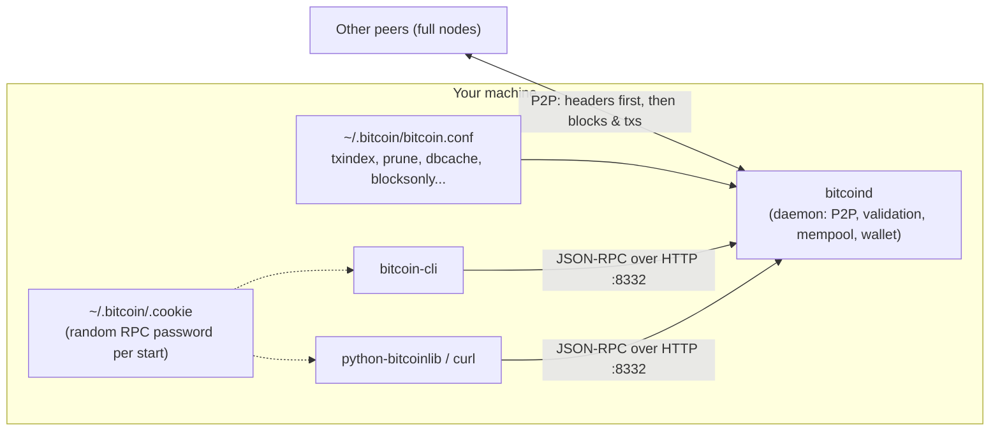
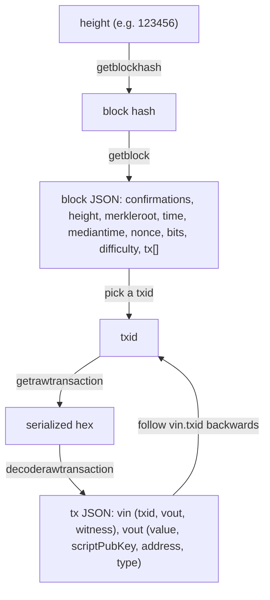

# Chapter 3: Bitcoin Core: The Reference Implementation (3rd ed., `ch03_bitcoin-core.adoc`)

Scope: what a full node is and why to run one; Bitcoin -> Bitcoin Core history; compiling from source (git tags, autogen/configure/make); running and configuring `bitcoind`; the JSON-RPC API via `bitcoin-cli` and `curl`; exploring transactions and blocks; alternative libraries. The book itself says the compile walkthrough is "highly technical" and can be skipped, so a conceptual quiz will most likely test the *ideas* (reference implementation, open source/MIT, full verification node, BIPs, RPC, txindex/prune) rather than command syntax. Command-level facts are marked MEDIUM/LOW.

**Lecture overlap:** W4 s13 Bitcoin Core download ('768 GB' ledger; the instructor called it 'the software to mine bitcoin', the book says reference implementation / full node); W4 s37-39 full node functions, solo vs pool miners, Stratum; W4 s29 miners keep the UTXO database; W4 s30-31 raw and decoded transaction examples (slide only); W4 s56 explorers; W2 s82 ECDSA twin signatures as a root cause of transaction malleability. Not covered in class: compiling, configuration options, JSON-RPC/bitcoin-cli, headers-first sync, BIPs, alternative implementations.

## Section by section: the claims a quiz can test

### Opening
- People accept money only if they believe they can spend it later; **counterfeit or debased** money may not be spendable -> strong incentive to **verify** received bitcoins.
- Bitcoin is designed so software on your **local computer** can "perfectly prevent counterfeiting, debasement, and several other critical problems." Such software = **full verification node** ("full node"): verifies **every confirmed transaction against every rule**.
- Data from your own node is **authoritative** "not because some powerful entity designated it as such but because your node independently verified it."

### From Bitcoin to Bitcoin Core
- Bitcoin is **open source under the MIT license**, developed by an **open community of volunteers**; at first only Satoshi; by 2023 **>1,000 contributors**, about a dozen full-time developers.
- Satoshi mostly **finished the software before publishing the whitepaper** ("wanted to make sure the implementation worked").
- The first implementation, called simply "Bitcoin", evolved into **Bitcoin Core** to differentiate it from other implementations.
- Bitcoin Core is the **reference implementation**: "provides a reference for how each part of the technology should be implemented." Implements **wallets, transaction and block validation engine, block construction tools, and all modern P2P communication**.
- The whitepaper describes early parts; **since 2011 most major parts are documented in BIPs (Bitcoin Improvement Proposals)**, referenced by number (e.g., **BIP9** = mechanism used for several major upgrades).

### Bitcoin Development Environment
- For developers; the chapter is technical and can be skipped if not setting up a dev environment.

### Compiling Bitcoin Core from the Source Code
- Source via download archive or `git clone https://github.com/bitcoin/bitcoin.git`.
- Shell conventions: `$` prompt, don't type the `$`.
- Git = most widely used **distributed version control system**.

#### Selecting a Bitcoin Core Release
- Default clone = latest (possibly unstable) code; **check out a release tag** (e.g., `git checkout v24.0.1`, current at time of writing) -> **detached HEAD**.
- Tags with suffix **"rc" = release candidates** (for testing); **stable releases have no suffix**.
- `git status` confirms "HEAD detached at v24.0.1".

#### Configuring the Bitcoin Core Build
- Read `README.md`, `doc/build-unix.md` (or `build-windows.md`, etc.). Build **prerequisites** (libraries) must be present or the build fails.
- `./autogen.sh` generates build scripts including **`configure`**.
- `./configure --help` lists `--enable-FEATURE` / `--disable-FEATURE` options. Useful options: `--prefix=$HOME` (install location instead of `/usr/local/`), `--disable-wallet`, `--with-incompatible-bdb` (Berkeley DB), `--with-gui=no` (skip Qt GUI).
- `./configure` discovers libraries and writes a customized build script; errors usually mean a missing/incompatible library.

#### Building the Bitcoin Core Executables
- `make` compiles (up to an hour); resumable; `make -j 2` for parallel jobs; **`make check` runs unit tests**; `sudo make install` installs to **`/usr/local/bin`** (`bitcoind`, `bitcoin-cli`, `bitcoin-tx`); verify with `which bitcoind`.

### Running a Bitcoin Core Node
- Nodes are run "mostly by individuals and some businesses"; they have a **direct and authoritative view** of the blockchain and **independently validated** UTXOs; **no reliance on third parties**; running one **contributes to network robustness**.
- Resource figures (2023): initial download **>500 GB**, **~400 MB/day** of new transactions; 10 days offline -> ~4 GB catch-up; **at least 1 TB** disk for several years if keeping a full copy; nodes also **upload** to peers (bandwidth); alternatives such as **Blockstream Satellite**. [LOW numeric]
- TIP: Bitcoin Core keeps a full copy of the blockchain by default (hundreds of GB), downloaded over hours or days; **cannot process transactions or update balances until fully synced**; pruning discards old blocks but the node **still downloads the entire dataset**.
- Thousands run nodes, some on a **Raspberry Pi**.
- **Reasons to run a node** (list): don't rely on third parties to validate; don't disclose which transactions are yours; developing software needing API access; applications that must validate per consensus rules; support Bitcoin. "If you're ... interested in strong security, superior privacy, or developing Bitcoin software, you should be running your own node."

### Configuring the Bitcoin Core Node
- Config file located via `bitcoind -printtoconsole` startup lines; default data directory **`~/.bitcoin`**, config file **`bitcoin.conf`**.
- **More than 100 options**; `bitcoind --help`.
- Key options (definitions are quizzable):
  - **`alertnotify`**: run a command/script for emergency alerts.
  - **`conf`**: alternative config-file location (command line only).
  - **`datadir`**: where blockchain data lives (default `.bitcoin`); 10 GB to ~1 TB.
  - **`prune`**: reduce disk usage to N megabytes by **deleting old blocks**; for resource-constrained nodes.
  - **`txindex`**: maintain an **index of all transactions** so any tx can be retrieved by ID (unless pruned).
  - **`dbcache`**: size of the **UTXO cache**, default **450 MiB**.
  - **`blocksonly`**: minimize bandwidth by accepting only blocks, **not relaying unconfirmed transactions**.
  - **`maxmempool`**: limit the transaction memory pool size in MB.
- Sidebar **txindex**: by default Core indexes **only the wallet's own transactions**; to use `getrawtransaction` on **any** transaction set `txindex=1`; enabling later requires waiting for the index to rebuild.
- Sample configs: full-index API node (`txindex=1`, big `datadir`) vs constrained (`blocksonly=1`, `prune=5000`, `dbcache=150`, `maxmempool=150`).
- Run in foreground with `-printtoconsole`; run in background with **`bitcoind -daemon`**.
- Monitor with **`bitcoin-cli getblockchaininfo`**: fields `chain`, `blocks`, `headers`, `bestblockhash`, `difficulty`, `verificationprogress`, `initialblockdownload`, `chainwork`, `size_on_disk`, `pruned`.
- A fresh node shows **blocks: 0, headers: 83,999**: the node **first fetches block headers** to find the chain with the most PoW, **then downloads full blocks, validating as it goes** (headers-first sync).
- Add Core to OS startup scripts (`contrib/init`).

### Bitcoin Core API
- Bitcoin Core implements a **JSON-RPC interface**, also accessible via the command-line helper **`bitcoin-cli`**.
- `bitcoin-cli help` lists RPC commands; `bitcoin-cli help <command>` gives parameter docs plus two examples (**`bitcoin-cli` and `curl`**).
- `bitcoin-cli getblockhash 1000` -> block hash `00000000c937...` (same on every node -> proves the node works).

#### Getting Information on Bitcoin Core's Status
- Most important status commands: **`getblockchaininfo`, `getmempoolinfo`, `getnetworkinfo`, `getwalletinfo`**.
- `getnetworkinfo` shows `version`, `subversion` (`/Satoshi:24.0.1/`), `protocolversion`, services (NETWORK, WITNESS, NETWORK_LIMITED), `connections`, `relayfee`, etc. Data is returned as **JSON**.
- Initial sync can take **more than a day**, validating "almost a billion transactions"; examples assume block >= 775,072.

#### Exploring and Decoding Transactions
- **`getrawtransaction <txid>`** returns the **serialized transaction in hex**; **`decoderawtransaction <hex>`** decodes it to JSON.
- TIP: **a txid is not authoritative**; absence from the blockchain doesn't mean it wasn't processed -> **transaction malleability** (tx can be modified before confirmation, changing its txid). After inclusion in a block the txid can only change via a **blockchain reorganization**, rare after several confirmations.
- Decoded fields: `txid`, `hash`, `version`, `size`, `vsize`, `weight`, `locktime`, `vin` (with `txid`, `vout`, `scriptSig`, `txinwitness`, `sequence`), `vout` (with `value`, `n`, `scriptPubKey` incl. `asm`, `hex`, `address`, `type` such as `witness_v1_taproot`, `witness_v0_keyhash`).
- Alice's tx: **one input, two outputs** (payment to Bob, change to Alice); following input txids backward traces the chain of ownership.

#### Exploring Blocks
- Blocks referenced by **height or hash**. **`getblockhash <height>`** -> header hash; **`getblock <hash>`** -> block JSON.
- Fields: `hash`, **`confirmations` (depth: how many blocks built on top)**, **`height` (how many blocks precede it)**, `version`, `merkleroot`, `time` (miner's clock), **`mediantime` (median of previous 11 blocks, harder for miners to manipulate)**, `nonce`, `bits`, `difficulty`, `chainwork`, `nTx`, `previousblockhash`, `nextblockhash`, `strippedsize`, `size`, `weight`, `tx` list.

#### Using Bitcoin Core's Programmatic Interface
- API = **JSON-RPC**: JSON data format; **RPC = remote procedure call** over **HTTP**; default RPC port **8332** on localhost.
- Authentication: Core creates a **random password at each start in the `.cookie` file** in the data directory (`__cookie__:<hex>`); `bitcoin-cli` reads it; can also create a static password with `share/rpcauth/rpcauth.py`.
- Wrapper libraries simplify calls; the book uses **`python-bitcoinlib`** (not part of Bitcoin Core).
- Examples: `rpc_example.py` prints block count; `rpc_transaction.py` lists Alice's outputs (addresses + values); `rpc_block.py` sums all output values in a block (**10,322.07722534 BTC including the 25 BTC reward and 0.0909 BTC fees**; some explorers exclude reward/fees) [LOW].

### Alternative Clients, Libraries, and Toolkits
- C/C++: **Bitcoin Core** (reference). JavaScript: **bcoin**, **Bitcore** (Bitpay), **BitcoinJS**. Java: **bitcoinj**. Python: **python-bitcoinlib** (Peter Todd), **pycoin** (Richard Kiss). Go: **btcd**. Rust: **rust-bitcoin**. Scala: **bitcoin-s**. C#: **NBitcoin**.
- Closing: with your own node you verify "without having to trust any outside authority."

## Key terms

| Term | Definition |
|---|---|
| Full verification node (full node) | Software that verifies every confirmed transaction against every consensus rule; gives an authoritative local view. |
| Bitcoin Core | The reference implementation, evolved from Satoshi's original "Bitcoin" client; implements wallet, validation engine, block construction, P2P. |
| Reference implementation | The implementation that defines how each part of the technology should behave. |
| MIT license / open source | Bitcoin's source is free to download and use for any purpose; developed by volunteers. |
| BIP (Bitcoin Improvement Proposal) | Numbered design documents that have specified most major parts of Bitcoin since 2011 (e.g., BIP9 upgrade mechanism). |
| `bitcoind` | The Bitcoin Core daemon (server). |
| `bitcoin-cli` | Command-line helper that calls the node's JSON-RPC API. |
| `bitcoin-tx` | Bundled command-line transaction utility (installed alongside). |
| Release tag / release candidate | Git tag marking a version; "rc" suffix = for testing; stable has no suffix. |
| Detached HEAD | Git state after checking out a tag rather than a branch. |
| `autogen.sh` / `configure` / `make` / `make check` / `make install` | Build pipeline: generate scripts, detect libraries and options, compile, run unit tests, install to /usr/local/bin. |
| Data directory | `~/.bitcoin` by default; holds blockchain data, `bitcoin.conf`, `.cookie`, wallets. |
| `bitcoin.conf` | Configuration file read at every start. |
| `prune` | Option to delete old blocks to cap disk use; still downloads everything. |
| `txindex` | Option to index all transactions so any txid is retrievable via `getrawtransaction`. |
| `dbcache` | UTXO cache size (default 450 MiB). |
| `blocksonly` | Accept only blocks; don't relay unconfirmed transactions (saves bandwidth). |
| `maxmempool` | Cap on mempool memory. |
| Mempool (memory pool) | Node's pool of unconfirmed transactions (implied by `maxmempool`, `getmempoolinfo`). |
| Initial block download (IBD) | Multi-hour/day sync: headers first (find most-PoW chain), then full blocks validated in order. |
| JSON-RPC | Remote procedure call protocol using JSON over HTTP; Core's API; default port 8332. |
| `.cookie` authentication | Random per-start RPC password stored in the data directory; read by `bitcoin-cli`. |
| `getblockchaininfo` / `getnetworkinfo` / `getmempoolinfo` / `getwalletinfo` | Main status RPCs. |
| `getrawtransaction` / `decoderawtransaction` | Fetch serialized hex of a tx / decode hex into JSON. |
| `getblockhash` / `getblock` | Height -> hash / hash -> block details. |
| Transaction malleability | Ability to modify a transaction before confirmation so its txid changes; why a txid is "not authoritative". |
| Blockchain reorganization | Replacement of recent blocks by a competing chain; rare after several confirmations. |
| Block height vs confirmations (depth) | Blocks preceding a block vs blocks built on top of it. |
| `mediantime` | Median timestamp of the previous 11 blocks; harder to manipulate than `time`. |
| Blockstream Satellite | Free satellite data feed as an alternative network for nodes. |
| Wrapper library | Language library (e.g., `python-bitcoinlib`) that wraps JSON-RPC calls. |
| bcoin, Bitcore, BitcoinJS, bitcoinj, pycoin, btcd, rust-bitcoin, bitcoin-s, NBitcoin | Alternative implementations/libraries by language. |

## Quizzable facts (numeric or calculation items are marked LOW)

1. A full node verifies **every** confirmed transaction against **every** rule -> prevents counterfeiting and debasement locally.
2. Your node's data is authoritative because **you** verified it, not because an authority said so.
3. Bitcoin is **open source (MIT)**, developed by an **open community**; >1,000 contributors by 2023.
4. Satoshi wrote the software **before** publishing the whitepaper.
5. Original client "Bitcoin" -> renamed **Bitcoin Core** to distinguish it from other implementations.
6. Bitcoin Core = **reference implementation**; implements wallet, validation engine, block construction, P2P.
7. **BIPs** document most major changes since 2011; **BIP9** = upgrade-deployment mechanism.
8. Release tags: **rc = release candidate (testing)**; no suffix = stable.
9. Build order: `autogen.sh` -> `configure` -> `make` -> `make check` (tests) -> `make install`. [MEDIUM]
10. `--with-gui=no` skips the Qt GUI; `--disable-wallet` drops the wallet; `--prefix=$HOME` changes install dir. [LOW]
11. Executables install to `/usr/local/bin`: `bitcoind`, `bitcoin-cli`, `bitcoin-tx`. [LOW]
12. Running a node removes reliance on third parties for validation and privacy, and supports the network.
13. Resource needs (2023): >500 GB initial, ~400 MB/day, >= 1 TB disk long-term. [LOW numeric]
14. A node **can't process transactions or show balances until fully synced**.
15. Pruning saves disk but the node **still downloads the whole chain**.
16. Nodes can run on a **Raspberry Pi**.
17. Default data dir `~/.bitcoin`; config `bitcoin.conf`; >100 options.
18. `txindex=1` needed to look up **arbitrary** transactions with `getrawtransaction`; default indexes only wallet transactions.
19. `prune` deletes old blocks; `blocksonly` stops relaying unconfirmed transactions; `dbcache` = UTXO cache (450 MiB default); `maxmempool` caps mempool; `alertnotify` runs an alert script.
20. `bitcoind -daemon` runs in background; `-printtoconsole` in foreground.
21. Sync is **headers-first**: fetch headers to find the most-PoW chain, then download/validate blocks.
22. Core's API is **JSON-RPC over HTTP**, port **8332**, helper `bitcoin-cli`, or `curl`.
23. RPC auth uses a random per-start cookie (`.cookie`) or a static `rpcauth` password.
24. Four key status RPCs: `getblockchaininfo`, `getmempoolinfo`, `getnetworkinfo`, `getwalletinfo`.
25. `getblockhash 1000` returns the same hash on every node (deterministic chain).
26. `getrawtransaction` returns **hex**; `decoderawtransaction` turns hex into JSON.
27. **A txid is not authoritative** before confirmation -> **transaction malleability**; after confirmation only a **reorg** can change it.
28. Decoded Alice tx: 1 input, 2 outputs (payment + change); output types `witness_v1_taproot` and `witness_v0_keyhash`. [MEDIUM]
29. Blocks are addressed by **height or hash**; `getblockhash` then `getblock`.
30. `confirmations` in `getblock` = **depth** (blocks on top); `height` = blocks before it.
31. `mediantime` = median of previous 11 blocks, harder to manipulate than `time`.
32. Block size is reported three ways: stripped size, size, weight. [LOW]
33. PoW/security fields in a block: merkle root, nonce, bits, difficulty, chainwork.
34. `python-bitcoinlib` is a wrapper library, **not** part of Bitcoin Core.
35. Block total in example = 10,322.07722534 BTC incl. 25 BTC reward + 0.0909 BTC fees; explorers may exclude reward/fees. [LOW]
36. Language -> library: Go = btcd, Java = bitcoinj, Rust = rust-bitcoin, C# = NBitcoin, JS = bcoin/Bitcore/BitcoinJS, Python = python-bitcoinlib/pycoin, Scala = bitcoin-s. [LOW]

## Misconceptions and traps (how distractors are built)

- "Bitcoin Core is the only Bitcoin implementation." No: it's the **reference** implementation; bcoin, btcd, bitcoinj, etc. exist.
- "Satoshi published the paper first, then wrote the code." Book: code was mostly done first.
- "Bitcoin Core is proprietary / owned by a foundation." No: MIT-licensed, volunteer community.
- "A pruned node doesn't need to download the full blockchain." It still downloads it all; it just discards old blocks.
- "You can query any transaction by txid on a default node." No: needs `txindex=1`.
- "A txid is a permanent unique identifier from the moment of broadcast." No: malleability before confirmation.
- "`blocksonly` means the node stores only block headers." No: it means it doesn't relay unconfirmed transactions.
- "`dbcache` caches blocks." No: it's the **UTXO** cache.
- "A node syncs by downloading blocks in order from the start." Headers first, then blocks.
- "`getblock` takes a height." No: it takes a **hash**; `getblockhash` converts height -> hash.
- "`confirmations` in a block means the number of transactions." No: depth; `nTx` is the transaction count.
- "The RPC API uses gRPC/REST/WebSocket." No: **JSON-RPC over HTTP** (port 8332).
- "`bitcoin-cli` is the node." No: it's a helper that talks to `bitcoind`.
- "`make check` installs the software." No: runs unit tests; `make install` installs.
- "`rc` tags are the most stable." Opposite: release candidates are for testing.
- "The wallet is separate software from Bitcoin Core." Core includes a wallet (can be disabled).
- Distractor for port: 8333 (P2P port, not in this chapter) vs **8332** (RPC).
- Distractor for default data dir: `/etc/bitcoin`, `/var/lib/bitcoin` vs **`~/.bitcoin`**.

## Diagrams: node components and the RPC exploration path

---

_Source: Mastering Bitcoin, 3rd edition, chapter 3 (github.com/bitcoinbook/bitcoinbook, `develop` branch). Lecture citations `W4 s18` = week-4 slide 18. Full lecture-vs-book analysis: the Cross-Reference page._
