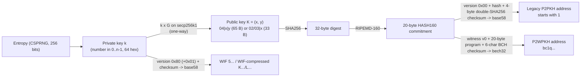
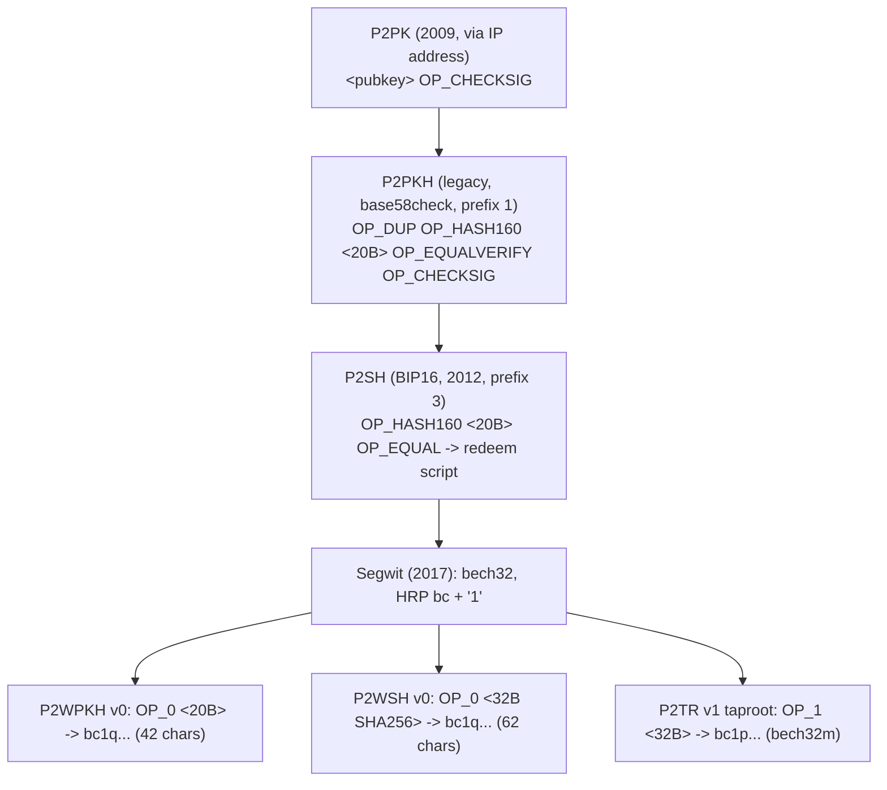
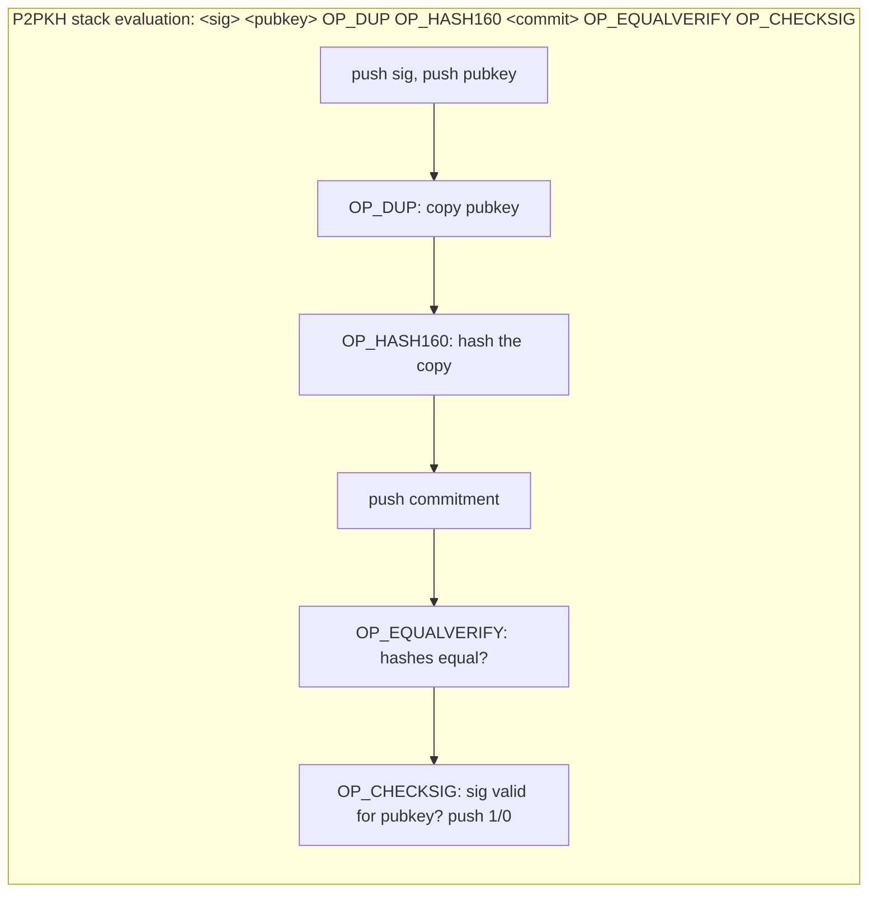

---
cursor:
  subagentId: "bc-8bc683e0-09f0-519a-ab41-a1865009aa67"
---

# Chapter 4: Keys and Addresses (3rd ed., `ch04_keys.adoc`)

Scope: public-key cryptography as used by Bitcoin (private key -> public key via elliptic-curve multiplication on secp256k1), hash functions as commitments, the evolution of address types (P2PK / IP addresses -> P2PKH with base58check -> P2SH -> bech32 segwit v0 -> bech32m taproot), compressed keys, WIF private-key formats, vanity addresses, paper wallets. Given that the instructor (Dr. Zheng) is a cryptographer, this chapter is likely to get at least its 4-question share; keep the "math" conceptual (one-way functions, why hashing, prefixes), since calculations are excluded.

## (a) Section-by-section outline with the claims a professor would test

### Opening
- Goal: Alice pays Bob without tying the transaction to Bob's identity or his other payments, while ensuring **only Bob can spend**.
- The whitepaper's scheme: Bob receives to a **public key**; Alice **signs** with the private key matching the public key she previously received to; full nodes verify the signature commits to a hash of Bob's public key and the transaction details.

### Public Key Cryptography
- Invented in the **1970s**; based on functions **easy one way, infeasible the other** (prime exponentiation, elliptic-curve multiplication). Bitcoin uses **elliptic-curve addition and multiplication**.
- Key pair: **private key** (sign to spend) and **public key** (receive funds) derived from it. Signatures made with the private key can be verified with the public key **without revealing the private key**.
- TIP: storing only the private key suffices; the public key can always be recomputed.
- Notation: private key **k** (a number, usually from a random number); public key **K** via elliptic-curve multiplication, a **one-way function**.
- Sidebar **Why Use Asymmetric Cryptography?**: it is **not used to encrypt transactions**; it's used for **digital signatures** so anyone can verify every signature while only key owners can produce them.

#### Private Keys
- "A private key is simply a number, picked at random." Control over it = control over all funds of the corresponding public key. Must stay **secret**; if **lost**, the funds are lost forever.
- TIP: toss a coin **256 times** to make one; any non-random process weakens it.
- First and most important step: a secure source of randomness (**entropy**). "Pick a number between 1 and 2^256." Software uses a **CSPRNG** to produce 256 bits.
- Range: **0 to n-1**, where **n ~ 1.1578 x 10^77** (slightly less than 2^256) is the **order of the curve**. Typical method: hash random bits with **SHA256** to get 256 bits, retry if >= n. [LOW: numeric]
- WARNING: never write your own RNG or use a language's "simple" RNG; use a CSPRNG.
- Example private key shown as **64 hex digits** (256 bits, 4 bits per hex digit).
- TIP: key space 2^256 ~ 10^77; the visible universe has ~10^80 atoms. [LOW]

#### Elliptic Curve Cryptography Explained
- ECC = asymmetric crypto based on the **discrete logarithm problem** over elliptic-curve points.
- Bitcoin's curve: **secp256k1** (standard published by **NIST**): **y^2 = x^3 + 7 over F_p**, with p a very large prime (p = 2^256 - 2^32 - 2^9 - 2^8 - 2^7 - 2^6 - 2^4 - 1). Because it is over a **finite field** it looks like scattered dots, but the math is the same as over the reals (illustrated with p = 17). [equation details LOW]
- **Point at infinity** plays the role of **zero**.
- **Point addition**: line through P1 and P2 hits the curve at a third point; reflect over the x-axis to get P3. Doubling uses the tangent. Vertical line -> point at infinity. Addition is **associative**.
- **Multiplication** kP = P + P + ... (k times); k is sometimes confusingly called an "exponent".

#### Public Keys
- **K = k x G**: G is the **generator point**, a constant fixed by secp256k1, the same for everyone. Reverse ("finding the discrete logarithm") is as hard as brute force.
- TIP: elliptic-curve multiplication is a **"trap door" function**: easy forward (multiply), infeasible backward (divide) -> basis for unforgeable signatures.
- Same k always gives the same K; K can be shared without revealing k. "A private key can be converted into a public key, but a public key cannot be converted back into a private key."
- Public key is a point **K = (x, y)**, each coordinate 256 bits.
- Visualization: G, 2G, 4G by tangent-and-reflect. Most implementations use **libsecp256k1**.

### Output and Input Scripts
- The first Bitcoin version didn't pay to bare pubkeys as in the paper; payments go to an **output script** and are spent with an **input script**, allowing extra conditions (e.g., two keys/two signatures).
- Mental model: **output script acts like a public key; input script acts like a signature**.

### IP Addresses: The Original Address for Bitcoin (P2PK)
- Public keys are long (130 hex chars uncompressed) -> hard to convey.
- Bitcoin **0.1** let a spender enter the receiver's **IP address**; the nodes connected and the receiver's wallet handed over a **fresh public key** (never reused -> unlinkable payments). Feature later **removed** ("many problems").
- Output script: `<Bob's public key> OP_CHECKSIG`; input script: `<Bob's signature>`.
- **Stack evaluation**: combine input script then output script; data pushed on a **stack**; **`OP_CHECKSIG`** consumes pubkey and signature, verifies the signature (which also commits to transaction fields), pushes **1** on success or **0** on failure; script passes if a **nonzero** item remains on top.
- This output type = **pay to public key (P2PK)**; never widely used; IP payments unsupported for ~a decade.

### Legacy Addresses for P2PKH
- IP-address downsides: receiver must be **online and reachable** (firewalls, NAT, sleeping laptops).
- Early public keys were **65 bytes** (130 hex chars); Bitcoin needed compact secure references -> **hash functions**.
- A hash function takes large input, scrambles it, outputs fixed size; same input -> same output; a secure one makes it impractical to find a different input with the same output -> the output is a **commitment** to the input ("only input x will produce output X"). Example: SHA256 commitment to the answer "2007" for when Satoshi started work.
- **SHA256** -> 256 bits (32 bytes); **RIPEMD-160** -> 160 bits (20 bytes). Original Bitcoin commits to a pubkey as **A = RIPEMD160(SHA256(K))** -> **20-byte** commitment ("for reasons Satoshi never stated"). This double hash is **HASH160**.
- Output script: `OP_DUP OP_HASH160 <commitment> OP_EQUALVERIFY OP_CHECKSIG`; input script: `<sig> <pubkey>`. Stack walk-through: DUP copies pubkey; HASH160 hashes it; push commitment; EQUALVERIFY compares (fails whole script if unequal); CHECKSIG verifies signature vs pubkey.
- Benefit: the payment contains only a **20-byte** commitment instead of a 65-byte key. Problem left: any copying mistake sends coins to an **unspendable output** -> need compact encoding with **checksums**.

### Base58check Encoding
- Higher radix = shorter strings: decimal 10, hex 16, **base64** (26+26+10+"+"+"/").
- **Base58** = base64 **minus** the easily confused **0 (zero), O (capital o), l (lower L), I (capital i)** and the symbols **+ and /**. Alphabet: `123456789ABCDEFGHJKLMNPQRSTUVWXYZabcdefghijkmnopqrstuvwxyz`.
- **Base58check** adds a **checksum**: **4 bytes** appended, derived from the hash of the data -> detects transcription/typing errors; wallets reject mistyped addresses instead of losing funds.
- Encoding steps: prepend a **version byte** (identifies data type; **0x00** = P2PKH commitment) -> checksum = first **4 bytes of SHA256(SHA256(prefix||data))** ("double-SHA") -> concatenate prefix + data + checksum -> encode in base58.
- Version prefixes and resulting leading characters (**high-yield table**):

| Type | Version prefix (hex) | Base58 result prefix |
|---|---|---|
| P2PKH address | 0x00 | **1** |
| P2SH address | 0x05 | **3** |
| Testnet P2PKH | 0x6F | **m or n** |
| Testnet P2SH | 0xC4 | **2** |
| Private key WIF | 0x80 | **5, K, or L** |
| BIP32 extended public key | 0x0488B21E | **xpub** |

- Figure: **public key -> SHA256 -> RIPEMD160 -> (version + hash + checksum) -> base58 -> address**.

### Compressed Public Keys
- Original keys were **65 bytes**; a later developer found a **33-byte** encoding, **backward compatible** (no protocol change): **compressed public keys**; smaller transactions -> more payments per block.
- Since y^2 = x^3 + 7, **y can be computed from x**, so store only x plus which of the two roots. **Uncompressed prefix 04** (04 || x || y = 130 hex); **compressed prefix 02 (y even) or 03 (y odd)** (66 hex digits, 264 bits).
- Crucial consequence: compressed and uncompressed forms of the **same key** hash to **different commitments -> different addresses**, though the private key is identical.
- Compressed keys are now the **default** and are **required for certain newer features**. Wallets importing old keys must know which form to scan for -> WIF was modified to flag compressed keys.

### Legacy Pay to Script Hash (P2SH)
- Receivers can require arbitrary constraints in the output script; conveying a large script to the spender (and paying fees on it) is costly -> commit to it with a hash.
- **BIP16 (2012)** lets an output script commit to a **redeem script**; the spender's input script must later provide the redeem script (serialized as one data element) **plus** the data (signatures) satisfying it.
- Example redeem script: `<pubkey1> OP_CHECKSIGVERIFY <pubkey2> OP_CHECKSIG` (two signatures: desktop + hardware signer).
- Commitment = **HASH160(redeem script)**; output script **template exactly** `OP_HASH160 <20 bytes> OP_EQUAL`. WARNING: any deviation from the exact template and the redeem script is ignored -> funds unspendable or anyone-can-spend.
- Spend: input `<sig2> <sig1> <redeem script>`; nodes hash the redeem script, compare to the commitment, then **execute the deserialized redeem script**.
- P2SH addresses: base58check with version **5** -> start with **3** (e.g., `3F6i6kwke...`).
- TIP: **P2SH is not necessarily multisig**; most often it wraps a multisig script, but it can encode other scripts.
- **P2PKH and P2SH are the only two script templates that use base58check**; now called **legacy addresses**, supplanted by **bech32**.
- Sidebar **P2SH Collision Attacks**: hash-based addresses are vulnerable to **preimage** (1 in 2^160), **second-preimage** (~1 in 2^160), and **collision** attacks; when an attacker can influence the input (e.g., a multisig participant who chooses their key last), strength drops to the **square root: 2^80**. All Bitcoin miners do ~2^80 hashes **per hour** (different function, but proves 160-bit collisions are practical). Newer addresses give **>= 128 bits** of collision resistance (2^128 ops ~ 32 billion years of current mining). Recommendation: new wallets should use newer address types.

### Bech32 Addresses
- **2017: segregated witness (segwit)** upgrade: prevents **txids from being changed** without the spender's consent (fixes malleability), adds **block capacity**, other benefits. Full benefits require receiving to **new output scripts**.
- Segwit could be used via **P2SH wrapping** (spender needn't know the script), but full benefits required Alice's wallet to support new scripts. **BIP142** proposed base58check with a new version byte; instead developers designed a new format, identifying **problems with base58check**:
  1. **Mixed case** is hard to read aloud/transcribe.
  2. It **detects** errors but **can't locate/correct** them.
  3. Mixed-case alphabet needs **larger QR codes**.
  4. It requires **every spender wallet to upgrade** for each new feature (P2SH, segwit), which takes years.
- **Bech32**: "bech" = **BCH** (Bose-Chaudhuri-Hocquenghem, 1959-60 cyclic code); "32" = **32-character alphabet**. Properties:
  - **Only numbers and one case of letters** (lowercase preferred); a P2WPKH bech32 address is only slightly longer than a P2PKH one.
  - **Detects and helps correct errors**: guaranteed to detect any error affecting **<= 4 characters**; can tell the user **where** errors are.
  - Can be written in **uppercase for QR codes** (special QR mode, smaller codes).
  - Uses segwit's **upgrade mechanism** so wallets can pay to **future output types** without upgrading (avoid system-wide upgrade cycles).

#### Problems with Bech32 Addresses
- Error-detection guarantee only holds for **same-length** input. A constant choice made it easy to **insert or delete "q"** in the **penultimate position** of an address ending in **"p"** without breaking the checksum (`bc1pqqqsq9txsqp` -> `bc1pqqqsq9txsqqqqp` ...).
- Not practical for **segwit v0** because only **two lengths** are valid (20- or 32-byte programs -> **42- or 62-character** addresses), but a problem for future versions.

#### Bech32m
- Fix: **change one constant** -> **bech32m** ("bech32 modified"); insertions/deletions of **up to five characters** fail to be detected less than **1 in a billion**.
- bech32 and bech32m addresses for the same data are identical **except the last six characters (checksum)**; the internal **version byte** tells the wallet which to validate.
- Address anatomy: **human-readable part (HRP)**: **`bc` = mainnet, `tb` = testnet**; **separator "1"** (a number so double-click selects the whole string; "1" isn't otherwise in the alphabet to avoid confusion with "l"); **data part**: **witness version** (1 char: **`q` = 0 = segwit v0**, **`p` = 1 = segwit v1 = taproot**; versions 0-16 allowed), **witness program** (2-40 bytes; v0 must be **20 or 32 bytes**; v1 defines 32), **checksum** (**6 characters**, a BCH code; use for **detection only**, not correction).
- Output script forms: **P2WPKH** = `OP_0 <20-byte HASH160(pubkey)>`; **P2WSH** = `OP_0 <32-byte SHA256(script)>` (SHA256 only, no RIPEMD-160 -> 256-bit commitment, avoids the P2SH collision weakness); **P2TR** = `OP_1 <32-byte x-only point>` (a pubkey, usually committing to extra data); future example `OP_16 0000`.
- The **only difference** between bech32 and bech32m in code is the constant (`1` vs `0x2bc830a3`) XORed into the checksum.
- Decoding returns (version, program) -> output script `<version> <program>`. WARNING: version 0 uses **OP_0 (0x00)** but version 1 uses **OP_1 (0x51)**, 2-16 -> 0x52-0x60.
- Use **BIP350 test vectors**, including future-version cases.
- Example addresses: P2WPKH `bc1q...` (42 chars), P2WSH `bc1q...` (62 chars), P2TR `bc1p...`.

#### Private Key Formats
- Same 256-bit number, several encodings: **Hex** (64 digits, internal), **WIF** (base58check, version **0x80**, starts with **5**), **WIF-compressed** (suffix **0x01** appended before encoding, starts with **K or L**). WIF is for **import/export** between wallets and QR codes.
- Sidebar **Modern Relevancy**: early wallets generated independent keys and needed re-backup whenever new keys appeared; **deterministic wallets** derive all keys from a **single seed** (backup once). Exporting one key from a deterministic wallet plus some nonprivate data can let an attacker derive **every** key; keys can't be imported into deterministic wallets -> almost no modern wallet supports single-key import/export. Section is mainly for compatibility with early wallets.

#### Compressed Private Keys
- "Compressed private key" is a **misnomer**: WIF-compressed is actually **one byte longer** (the **0x01 suffix**) and means "private key from which **only compressed public keys** should be derived". Private keys themselves **cannot be compressed**. Use "WIF-compressed"/"WIF" for formats, not "compressed private key".
- Same version 0x80 for both; the extra byte changes the leading base58 char from **5 to K/L** (analogy: 99 vs 100).
- Not interchangeable: new wallets export only WIF-compressed (K/L); old wallets only WIF (5) -> signals the importer whether to search for compressed or uncompressed pubkeys/addresses.

### Advanced Keys and Addresses
#### Vanity Addresses
- Valid addresses containing human-readable patterns (e.g., `1LoveBPzz...`); found by **brute force**: pick random key -> pubkey -> address -> test pattern, billions of times.
- **No less or more secure** than any other address (same ECC/SHA).
- Example: Eugenia (children's charity, Philippines) wants **"1Kids"**. Range `1Kids111...` to `1Kidszzz...` ~ 58^29 addresses. Each additional character multiplies difficulty by **58**; a desktop does ~100,000 keys/s: "1Kids" (4 chars) ~1 minute, "1KidsC" ~1 hour, 7 chars months, "1KidsCharity" ~2.5 million years. **GPUs** or a **vanity pool** (outsourced search for a fee) for >7 chars. [numbers LOW]
- **Security and privacy**: vanity addresses have "almost entirely disappeared" by 2023 because (1) **deterministic wallets** can't use them without extra backup and typically **don't allow importing** keys; (2) **address reuse** links all payments, hurting privacy of payers/payees.

#### Paper Wallets
- Private keys printed on paper, often with the address (derivable anyway). Designs: gift themes, scratch-off/tamper-evident, detachable stubs for redundancy.
- WARNING: paper wallets are an **OBSOLETE** and **dangerous** technology (back-doored generators have stolen many bitcoins); "DO NOT USE PAPER WALLETS"; use a **recovery code**, possibly with a **hardware signing device**.

## (b) Key terms

| Term | Definition |
|---|---|
| Public key cryptography (asymmetric) | Key pair where the private key signs and the public key verifies; based on one-way functions; in Bitcoin used for signatures, not encryption. |
| Private key (k) | A random 256-bit number in [0, n-1]; grants control of funds; must stay secret and be backed up. |
| Public key (K) | Point on secp256k1, K = k x G; used to receive funds; safe to share. |
| Entropy / CSPRNG | Randomness needed to pick k; a cryptographically secure pseudorandom number generator supplies it. |
| Elliptic curve cryptography (ECC) | Asymmetric crypto based on the discrete log problem over curve points. |
| secp256k1 | Bitcoin's curve/constants: y^2 = x^3 + 7 over the prime field F_p; standard from NIST. |
| Finite field of prime order (F_p) | Arithmetic modulo a large prime p; makes the curve a scatter of points. |
| Generator point (G) | Fixed base point of secp256k1 used by everyone to compute K = k x G. |
| Point at infinity | The "zero" of elliptic-curve addition. |
| Point addition / multiplication | Geometric line-and-reflect operation; kP = P added to itself k times. |
| Discrete logarithm problem | Finding k from K = kG; infeasible (brute force). |
| Trap door (one-way) function | Easy forward, infeasible backward; EC multiplication is one; basis for unforgeable signatures. |
| Digital signature | Value produced with the private key over a transaction, verifiable by anyone with the public key. |
| libsecp256k1 | Library most Bitcoin implementations use for the curve math. |
| Output script / input script | Output script sets spending conditions (like a public key); input script satisfies them (like a signature). |
| Stack / opcode | Script data is pushed onto a stack; opcodes (OP_CHECKSIG, OP_DUP, OP_HASH160, OP_EQUALVERIFY, OP_EQUAL) operate on the top items. |
| OP_CHECKSIG | Consumes pubkey and signature, pushes 1 if the signature is valid and commits to the transaction, else 0. |
| P2PK (pay to public key) | Output `<pubkey> OP_CHECKSIG`; the original type; used with IP-address payments; never widely used. |
| IP-address payment | Bitcoin 0.1 feature: connect to the receiver's node to fetch a fresh pubkey; removed. |
| Hash function / commitment | Fixed-size scramble of arbitrary input; deterministic; secure hash output is a commitment to its input. |
| SHA256 | 256-bit (32-byte) hash; Bitcoin's most common hash function. |
| RIPEMD-160 | 160-bit (20-byte) hash used after SHA256 for legacy commitments. |
| HASH160 | RIPEMD160(SHA256(x)); 20-byte commitment used by P2PKH and P2SH. |
| P2PKH (pay to public key hash) | Legacy output `OP_DUP OP_HASH160 <hash> OP_EQUALVERIFY OP_CHECKSIG`; addresses start with 1. |
| Base58 | Base64 alphabet minus 0, O, l, I, +, / to avoid confusion. |
| Base58check | Base58 with version byte prefix and a 4-byte double-SHA256 checksum for error detection. |
| Version byte / prefix | Byte prepended before base58check identifying the data type (0x00 -> "1", 0x05 -> "3", 0x80 -> "5/K/L", 0x0488B21E -> "xpub"). |
| Checksum | 4 bytes (base58check) or 6 characters (bech32/bech32m) used to detect transcription errors. |
| Uncompressed public key | 65 bytes: prefix 04 + x + y. |
| Compressed public key | 33 bytes: prefix 02 (even y) or 03 (odd y) + x; same key, different address than uncompressed form. |
| P2SH (pay to script hash) | BIP16 (2012): output `OP_HASH160 <20-byte hash> OP_EQUAL` commits to a redeem script; addresses start with 3. |
| Redeem script | The full script whose hash is committed in a P2SH output; revealed in the input script at spend time. |
| Multisignature | Script requiring multiple signatures; the most common P2SH use, but P2SH != multisig. |
| Legacy addresses | P2PKH and P2SH, the only base58check script templates. |
| Preimage / second-preimage / collision attack | Finding an input for a given hash / a different input with the same hash / any two inputs colliding; collision resistance is only half the bit-length (2^80 for HASH160). |
| Segregated witness (segwit) | 2017 upgrade: prevents third-party txid changes (malleability fix), adds capacity; new output types. |
| Bech32 | Segwit v0 address format: single-case alphabet of 32 chars, BCH-code checksum, error detection/location, better QR codes. |
| Bech32m | Bech32 with one constant changed to fix the "q" insertion/deletion weakness; used for segwit v1+ (taproot). |
| Human-readable part (HRP) | `bc` mainnet, `tb` testnet; followed by separator "1". |
| Witness version | First data character: `q` = v0, `p` = v1 (taproot); 0-16 allowed. |
| Witness program | 2-40 bytes; v0 must be 20 (P2WPKH) or 32 (P2WSH) bytes; v1 is 32 bytes (P2TR). |
| P2WPKH / P2WSH / P2TR | Segwit v0 key-hash / v0 script-hash (SHA256 only) / v1 taproot output types. |
| Taproot | Segwit v1; output is a tweaked public key; addresses start `bc1p`. |
| BIP173 / BIP350 | Bech32 spec / bech32m spec (with test vectors). BIP142 was the abandoned base58 segwit proposal. |
| WIF (Wallet Import Format) | Base58check-encoded private key, version 0x80, starts with 5. |
| WIF-compressed | WIF with 0x01 suffix, starts with K or L; means "derive only compressed pubkeys". |
| Vanity address | Address with a human-readable prefix found by brute-force search; equally secure; obsolete due to deterministic wallets and address reuse concerns. |
| Vanity pool | Service that searches for vanity patterns for a fee. |
| Paper wallet | Private key printed on paper; declared obsolete and dangerous. |
| Deterministic wallet | Wallet deriving all keys from one seed (back up once); precludes single-key import. |

## (c) Quizzable facts

1. Bitcoin uses asymmetric crypto for **digital signatures, not encryption**.
2. Public key **receives**, private key **signs/spends**; signature verifiable without revealing the private key.
3. A private key is **just a random number** (256 bits, 64 hex digits); can be chosen with 256 coin tosses.
4. Losing the private key = losing the funds **forever**; revealing it = giving away the funds.
5. Key generation needs **entropy**; use a **CSPRNG**, never a simple RNG.
6. Private key range 0..n-1 with n ~ 1.158 x 10^77 (order of the curve, just under 2^256). [LOW]
7. ECC is based on the **discrete logarithm problem**.
8. Bitcoin's curve: **secp256k1**, equation **y^2 = x^3 + 7** over a prime field; defined in a **NIST** standard.
9. **K = k x G**; **G = generator point**, constant for all users.
10. Elliptic-curve multiplication is a **one-way / trap door** function: pubkey -> privkey is infeasible.
11. Same private key always yields the same public key.
12. Point at infinity acts as zero; point addition is line-intersect-and-reflect; doubling uses the tangent.
13. Public key = point (x, y); uncompressed = **04 || x || y (65 bytes)**; compressed = **02/03 || x (33 bytes)**, 02 if y even, 03 if y odd.
14. Compressed and uncompressed forms of the same key produce **different addresses**; compressed is the modern default and required for newer features.
15. Output script ~ public key; input script ~ signature; scripts run on a **stack**; success if top item nonzero.
16. **OP_CHECKSIG** verifies signature against pubkey and pushes 1/0.
17. Original address form was the **IP address** (Bitcoin 0.1) leading to a **P2PK** output; removed because receivers had to be online/reachable.
18. Hash function output is a **commitment**: deterministic, infeasible to find another input.
19. **SHA256 = 32 bytes; RIPEMD-160 = 20 bytes; HASH160 = RIPEMD160(SHA256(x))** = the legacy pubkey/script commitment.
20. P2PKH script: `OP_DUP OP_HASH160 <20B> OP_EQUALVERIFY OP_CHECKSIG`; input `<sig> <pubkey>`.
21. Why P2PKH: a **20-byte** commitment instead of a **65-byte** key.
22. Base58 drops **0, O, l, I** and **+ /**; alphabet begins `123456789ABCDEFGHJKLMNPQRSTUVWXYZabcdefghijkmnopqrstuvwxyz`.
23. Base58check = **version byte + data + 4-byte checksum** (first 4 bytes of **double SHA256**), then base58.
24. Prefix table: **1** = P2PKH (0x00), **3** = P2SH (0x05), **m/n** = testnet P2PKH, **2** = testnet P2SH, **5/K/L** = WIF private key (0x80), **xpub** = extended public key.
25. **P2SH = BIP16, 2012**; output `OP_HASH160 <20B> OP_EQUAL` commits to a **redeem script**; spender supplies redeem script + signatures.
26. P2SH template must be **exact**, or funds become unspendable/anyone-can-spend.
27. **P2SH is not necessarily multisig.**
28. P2PKH and P2SH are the **only** base58check templates = **legacy addresses**.
29. Collision attacks: HASH160 gives **2^80** collision resistance when the attacker influences input (e.g., multisig); miners do ~2^80 hashes/hour; newer addresses give **>= 128 bits**. [MEDIUM]
30. **Segwit (2017)** fixes third-party **txid malleability** and adds capacity.
31. Base58check problems: mixed case, detect-but-not-locate errors, bigger QR codes, requires spender-wallet upgrades for new features.
32. **Bech32**: BCH code, 32-char single-case alphabet, detects any error of <= 4 chars, locates errors, uppercase QR mode, forward-compatible with future segwit versions.
33. Bech32 weakness: **"q" insertion/deletion before a final "p"**; bech32m fixes it by **changing one constant**; the two differ only in the **last 6 checksum characters**.
34. Address anatomy: HRP **bc** (mainnet) / **tb** (testnet), separator **1**, witness version (**q = v0, p = v1/taproot**), witness program, 6-char checksum.
35. **P2WPKH** = `OP_0 <20B HASH160>`; **P2WSH** = `OP_0 <32B SHA256(script)>`; **P2TR** = `OP_1 <32B point>`.
36. Segwit v0 programs are **20 or 32 bytes** -> addresses of **42 or 62** characters. [LOW]
37. `bc1q...` = segwit v0; `bc1p...` = taproot (segwit v1).
38. Witness version 1 is encoded with **OP_1 (0x51)**, not 0x01. [LOW]
39. WIF: version **0x80**, starts with **5**; WIF-compressed adds **0x01 suffix**, starts with **K or L**; "compressed private key" is a **misnomer** (it's one byte longer).
40. Modern deterministic wallets rarely import/export single keys; exporting one key + nonprivate data can expose the whole wallet.
41. Vanity addresses: brute-force search; **equally secure**; each extra character multiplies work by **58**; obsolete due to deterministic wallets and address-reuse privacy loss.
42. Paper wallets are **obsolete and dangerous**; use recovery codes and hardware signing devices.
43. Most implementations use **libsecp256k1**.

## (d) Common misconceptions and good distractors

- "Bitcoin encrypts transactions with public-key cryptography." No: it uses **signatures**; transactions are public.
- "The public key is derived from the address" / "the private key can be computed from the public key." No: derivation is one-way k -> K -> address.
- "A Bitcoin address is the public key." No: an address encodes a **hash (commitment)** of the key (or script), plus version and checksum.
- "The address is registered on the blockchain when created." No (ch01): addresses are just derived numbers.
- "Compressed public keys and uncompressed keys give the same address." No: different HASH160 -> different address.
- "A compressed private key is shorter." No: WIF-compressed is one byte **longer**; only the derived pubkeys are compressed.
- "Addresses starting with 3 are always multisig." No: P2SH can wrap any script.
- "Base58 just means base64 without symbols." It also removes 0, O, l, I.
- "The base58check checksum uses RIPEMD-160." No: first 4 bytes of **double SHA256**.
- "Bech32 addresses are case-insensitive mixed case like base58." Bech32 is single-case (lowercase preferred, all-uppercase allowed for QR).
- "Bech32m replaced bech32 for all addresses." No: bech32 remains for segwit **v0** (`bc1q`); bech32m for **v1+** (`bc1p`).
- "The '1' in bc1... is a version number." No: it's the **separator**; the version is the next char (q/p).
- "bc1 addresses use base58check with a new version byte." That was BIP142, abandoned.
- "P2WSH uses HASH160 like P2SH." No: **SHA256 only**, 32 bytes.
- "Segwit was introduced in 2012 / P2SH in 2017." Swap: **P2SH 2012 (BIP16), segwit 2017**.
- "Vanity addresses are weaker/stronger than normal ones." Equally secure.
- "Paper wallets are the safest cold storage." Book: obsolete, dangerous.
- "secp256k1 was designed by Satoshi." It's a standard curve (NIST/SECG); Satoshi chose it.
- "ECC security relies on factoring large primes." No: **discrete logarithm** on the curve (RSA relies on factoring).
- "The generator point differs per user." No: fixed for all.
- "OP_CHECKSIG pushes the signature back." It pushes **1 or 0**.
- "The first Bitcoin release paid directly to addresses like 1abc..." No: IP addresses / P2PK came first; base58 P2PKH addresses followed.
- Distractor sizes: 16 vs **20 bytes** (RIPEMD-160), 32 bytes (SHA256), 33 vs 65 bytes (compressed vs uncompressed pubkey), 4-byte vs 6-char checksum.

## (e) Diagram: private key -> public key -> address, and address family tree

