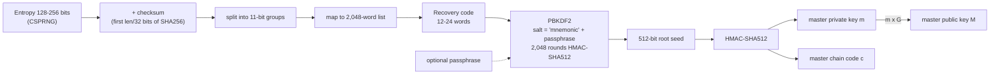
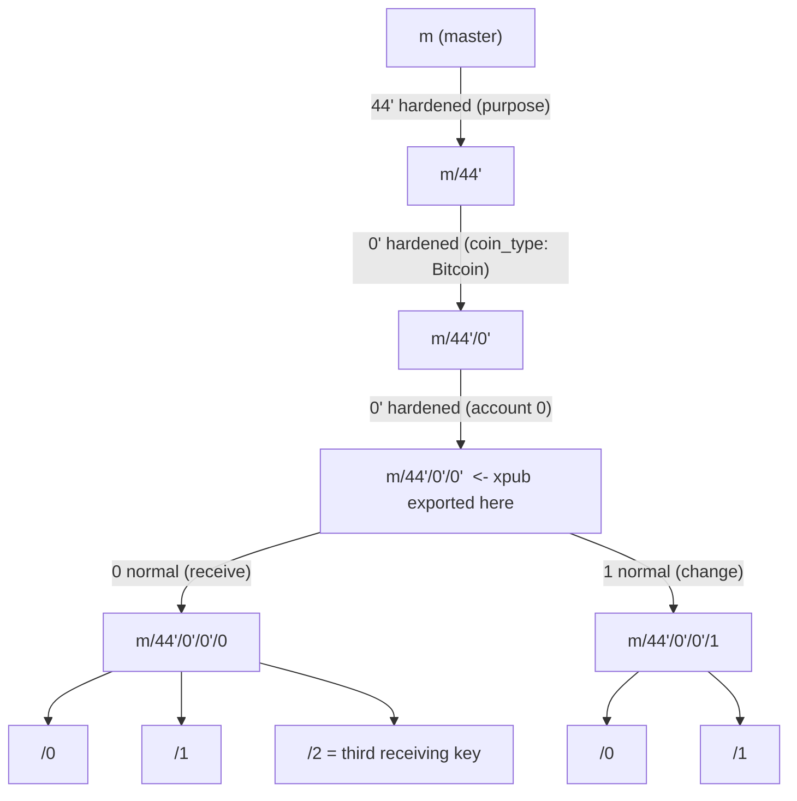
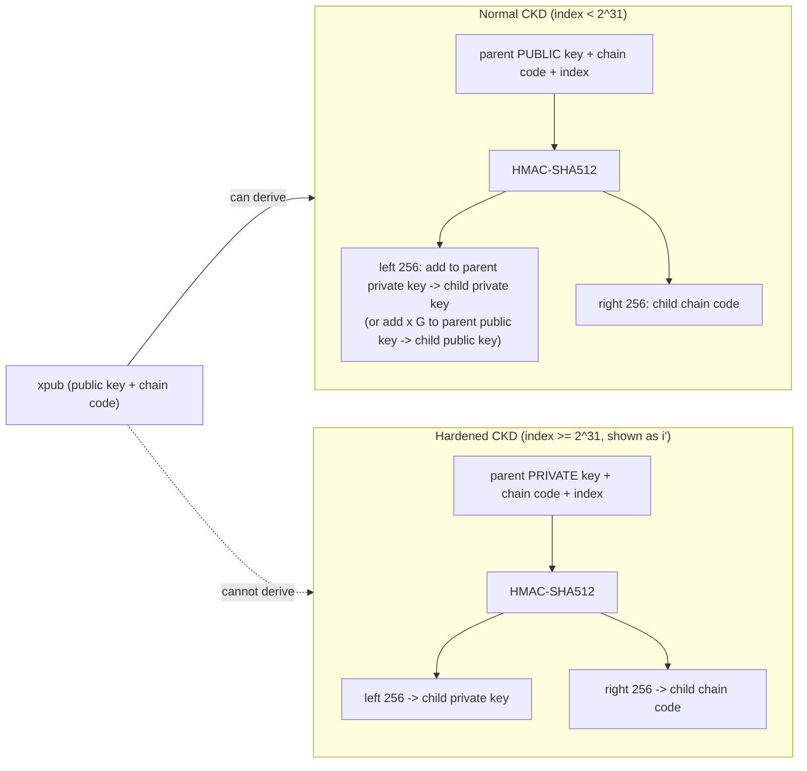

---
cursor:
  subagentId: "bc-8bc683e0-09f0-519a-ab41-a1865009aa67"
---

# Chapter 5: Wallet Recovery (3rd ed., `ch05_wallets.adoc`)

Scope: how wallets avoid turning data loss into money loss. Nondeterministic vs deterministic vs hierarchical deterministic (HD, BIP32) key generation; public child key derivation and key tweaks; seeds and recovery codes (BIP39, Electrum v2, Aezeed, Muun, SLIP39, Codex32) and passphrases; backing up nonkey data (labels, LN channel state); implicit (BIP44/49/84/86) vs explicit (descriptors) derivation paths; then the detailed "stack": BIP39 word generation and PBKDF2 seed stretching, BIP32 master key/chain code, CKD, extended keys (xprv/xpub), public derivation on a web store, gap limit, hardened derivation, index numbers and the prime notation, HD paths, BIP43/BIP44 tree structure. Note the 3rd-edition title is **"Wallet Recovery"**, not "Wallets" (2nd ed.).

## (a) Section-by-section outline with the claims a professor would test

### Opening
- Losing a private key can make funds unspendable forever; wallet/protocol developers design systems to **recover access after a problem without weakening security the rest of the time**.
- Some solutions are universal best practices; others involve trade-offs.

### Independent Key Generation
- Physical wallets hold cash, so people think Bitcoin wallets hold bitcoins; in fact the **wallet database contains only keys**; the bitcoins are records on the blockchain, spendable by proving key control to full nodes.
- Wallet databases may hold both public and private keys, only public keys, or only some private keys (multisig / hardware-signer setups).
- Early wallets **independently generated each key** -> required a **new backup every time new keys were created** (possibly every new address); missing a backup = losing funds received to un-backed-up keys. Each key ~32 bytes plus overhead.
- Using a **single key** minimizes backup but **severely reduces privacy**; privacy-conscious users made a new key pair per transaction -> databases only backed up digitally.
- Figure: **nondeterministic (Type-0) wallet** = "collection of independently generated keys".
- Modern wallets derive all keys from a **single random seed** with a **deterministic** algorithm.

#### Deterministic Key Generation
- A hash function gives the same output for the same input and unpredictable output for changed input -> one random **seed** yields a practically unlimited sequence of seemingly random values, **reproducibly**. Example: `sha256(seed + i)` for i = 0,1,2.
- Backup = **the seed plus a reference to the algorithm**; Alice with a million addresses backs up one 32-byte hex string.
- Figure: **Type-1 deterministic (sequential) wallet**. Modern wallets add a trick that lets **public keys be derived separately from private keys**, so private keys can be stored more securely than public keys.

#### Public Child Key Derivation
- EC operations are analogous to arithmetic; you can **add to a public key**. Since K = kG, then **K + 123G == (k + 123)G**: adding a value to the public side matches adding it to the private side.
- TIP on notation: single "=" computes; double "==" asserts equivalence.
- Bob, knowing only Alice's public key K and G, can derive **child public keys** without knowing k; if he tells Alice the value added (the **key tweak**), she derives the matching child private key. With a deterministic tweak algorithm, one public parent gives an unlimited sequence of public children; the private-key holder derives the private children.
- Used to separate a **wallet frontend** (public keys only) from **signing** (private keys), e.g., on a **hardware signing device** ("sometimes confusingly called a hardware wallet"): frontend hands out addresses, later passes tweaks to the signer, which derives child private keys, signs, and returns the signed transaction for broadcast.
- Public derivation gives a **linear sequence**; modern wallets add one more trick to produce a **tree**.

#### Hierarchical Deterministic (HD) Key Generation (BIP32)
- "Every modern Bitcoin wallet of which we're aware uses HD key generation by default." Defined in **BIP32**: deterministic generation + optional public child derivation -> a **tree of keys**; any key can parent a sequence of children; **no arbitrary depth limit**.
- The tree expresses organization: e.g., one branch for **receiving payments**, another for **change**; corporate branches per department/subsidiary/function.

#### Seeds and Recovery Codes
- HD wallets regenerate all private keys from the **original seed** if the database is lost; but **anyone with the seed can steal everything** from a single-sig wallet.
- Seeds are **128-256-bit** random numbers; most recovery codes use **human-language words** (motivation: memorability). Example: hex `0C1E 24E5 ...` = words `army van defense carry jealous true garbage claim echo media make crunch`.
- Memorizing can help (e.g., crossing borders), but **relying on memory alone is dangerous**: forget it -> funds lost; die/injured -> heirs can't inherit; **coercion** risk (Jameson Lopp documented **>100 physical attacks**, at least three deaths). TIP: **write it down** even if memorizable.
- **Types of recovery codes** (compare/contrast is quizzable):
  - **BIP39**: most popular for a decade; random bytes + checksum -> **12 to 24 words** (localizable word lists); words + optional passphrase go through a **key-stretching function** -> seed. Has shortcomings later schemes address.
  - **Electrum v2**: word-based; **no global word list dependency**; includes a **version number** (reliability/efficiency); optional passphrase (called **"seed extension"**); same key-stretching function.
  - **Aezeed** (LND wallet): **two version numbers** (internal for upgrades; external for changing crypto properties); includes a **wallet birthday** (creation date) so restoration needn't scan the whole blockchain (good for privacy-focused light clients); supports changing passphrase without moving funds; still depends on a shared word list.
  - **Muun**: multi-key by default; a **nonword code** that must be paired with extra information (a **PDF**); the code **decrypts private keys** in the PDF rather than encoding a seed; unwieldy but supports LN, descriptors, miniscript.
  - **SLIP39**: BIP39 successor (same authors); **splits one seed across multiple recovery codes** stored in different places with a threshold (e.g., **3 of 5**); optional passphrase; global word list; **no versioning**.
  - NOTE **Codex32**: newer proposal similar to SLIP39; codes can be created/validated **by hand** (paper, scissors, brass fasteners, pen) or by software; up to **31** shares with a threshold.
- Sidebar **Recovery Code Passphrases**: BIP39, Electrum v2, Aezeed, SLIP39 support an optional passphrase. In **BIP39, Electrum v2, SLIP39 the passphrase is not covered by the checksum** -> **every passphrase yields a valid (different) key tree**:
  - Positive: an attacker with the code but not the passphrase sees a valid tree; a **decoy balance** can act as a canary; multiple valid passphrases = **plausible deniability**.
  - Negative: under coercion the attacker can't be convinced you've revealed everything -> may keep coercing; **reduced error detection**: a typo'd passphrase silently gives an empty wallet (novices may think funds are gone and discard the code; or use the wrong tree for years).
  - **Aezeed authenticates its passphrase** (errors on a wrong one) -> no plausible deniability, but error detection and provability. Debate is unresolved.

#### Backing Up Nonkey Data
- Private keys are the most important data, but wallets also store **labels** (e.g., Bob labels the address he gave Alice; Alice labels her payment "Paid Bob for podcast") and sometimes **exchange rates** (for taxes). Labels stay **in the wallet, not on the blockchain** (privacy).
- Labels are **not deterministic** -> can't be restored from a recovery code; seed-only recovery shows just times and amounts (like a bank statement with blank descriptions). Wallets should offer label backup; many don't. **BIP329** proposes a standard label export format.
- Wallets with extra protocols (e.g., **Lightning Network**) store more; LN's **static channel backups** can't guarantee recovery; if the counterparty notices data loss it **may steal funds**; if both lose data, both lose.
- Solution some wallets use: **frequent automatic encrypted backups** of the whole wallet database, encrypted with a **key derived from the seed**, safe to store on untrusted servers/cloud/peers; restore = recovery code -> seed -> decryption key -> labels and protocol data.

#### Backing Up Key Derivation Paths
- BIP32 tree: ~**4 billion** first-level keys, each with 4 billion children, etc. -> a wallet can't scan every possible key, so recovery needs the **recovery code + seed algorithm (e.g., BIP39) + derivation algorithm (BIP32) + the paths the wallet used**.
- Solution 1: **implicit paths** = standardized paths defined by BIPs:

| Standard | Script | BIP32 path |
|---|---|---|
| BIP44 | P2PKH (legacy) | `m/44'/0'/0'` |
| BIP49 | Nested P2WPKH (P2SH-wrapped segwit) | `m/49'/1'/0'` (as printed in the book; note the `1'` coin type there is testnet) |
| BIP84 | P2WPKH (native segwit) | `m/84'/0'/0'` |
| BIP86 | P2TR single-key (taproot) | `m/86'/0'/0'` |

  - Advantage: users needn't record paths; same app (same or newer version) regenerates them.
  - Disadvantages: **inflexible**: the wallet must derive and scan **every path it supports**; recovery codes **without versions (BIP39, SLIP39)** can't warn when an app drops or lacks a path (Electrum v2 and Aezeed can); can only restore **universal or seed-derived** data, so user-specific nondeterministic data (e.g., **the other cosigners' public keys in a 2-of-3 multisig**) can't be recovered from the code alone.
- Solution 2: **explicit paths** = back up path info with the recovery code. Almost all use **output script descriptors** ("descriptors", **BIPs 380-386, 389**), which describe a script and the keys/paths for it, e.g., `pkh(02c6...)`, `sh(multi(2,022f...,03ac...))`, `pkh([d34db33f/44'/0'/0']xpub6ERA.../1/*)`.
  - Advantages: exact, no legacy-script scanning, no compatibility issues, can embed extra data (cosigner keys). Disadvantage: **more to back up**; the extra data can hurt **privacy** but usually can't compromise security.
- Trend: single-sig wallets -> implicit paths; multisig/advanced wallets -> descriptors; many do both.

### A Wallet Technology Stack in Detail
- Focus stack (most widely used as of early 2023): **BIP39 recovery codes + BIP32 HD derivation + BIP44-style implicit paths**; all date from **2014 or earlier**.

#### BIP39 Recovery Codes
- Word sequences encoding a random number used as a **seed** for a deterministic wallet; **12-24 words** shown at wallet creation; sufficient to recreate the seed and all keys in any compatible wallet.
- TIP: recovery codes are **not brainwallets**: brainwallet words are **chosen by the user** (humans are poor randomness sources); recovery codes are **generated randomly by the wallet**.
- BIP39 was proposed by the company behind the **Trezor** hardware wallet; widely but not universally compatible.
- Nine steps split into generation (1-6) and seed derivation (7-9).

##### Generating a recovery code (steps 1-6)
1. Create **128-256 bits** of random entropy.
2. Checksum = first **(entropy length / 32)** bits of the entropy's **SHA256** hash.
3. Append the checksum to the entropy.
4. Split into **11-bit** segments.
5. Map each 11-bit value to a word in the **2,048-word** dictionary (2^11 = 2048).
6. The word sequence is the recovery code.

| Entropy bits | Checksum bits | Total bits | Words |
|---|---|---|---|
| 128 | 4 | 132 | **12** |
| 160 | 5 | 165 | 15 |
| 192 | 6 | 198 | 18 |
| 224 | 7 | 231 | 21 |
| 256 | 8 | 264 | **24** |

##### From recovery code to seed (steps 7-9)
- The 128-256-bit entropy is stretched to a **512-bit seed** with the key-stretching function **PBKDF2**.
- PBKDF2 takes the entropy (the words) and a **salt**; a salt makes lookup-table brute force hard, and in BIP39 it also carries the optional **passphrase**.
7. First PBKDF2 parameter: the recovery words (entropy from step 6).
8. Second parameter: the **salt = the string "mnemonic" + optional passphrase**.
9. PBKDF2 runs **2,048 rounds of HMAC-SHA512** -> **512-bit seed**.
- TIP: 2,048 rounds only slightly slows software brute force and barely affects special hardware; the code's **length (>= 128 bits)** provides the real security; stretching helps when an attacker knows **part** of the code; BIP39's parameters were weak even in 2013, likely for low-power hardware signers; Aezeed uses **32,768 rounds of scrypt**.
- Examples: 12 words `army van defense ...` with no passphrase vs passphrase `SuperDuperSecret` give **different 512-bit seeds**; 24-word example `cake apple borrow ...`.
- Sidebar **How Much Entropy Do You Need?**: BIP32 seeds 128-512 bits; BIP39 128-256; Electrum v2 132; Aezeed 128; SLIP39 128 or 256. Extended private keys are 512 bits (256-bit key + 256-bit chain code) so >512 bits is pointless; regular private keys are 256 bits so >256 bits of entropy adds nothing; **security strength of a Bitcoin public key is 128 bits** (~2^128 EC operations to break), so >128 bits has no apparent benefit, except that longer codes resist **partial exposure** (half of 128 bits is brute-forceable; half of 256 is not). Most wallets in 2023 use **128 bits** (12 words).

##### Optional passphrase in BIP39
- No passphrase -> salt "mnemonic" -> one specific seed. With a passphrase -> **different seed**; **every passphrase is valid** ("there is no wrong passphrase"); each leads to an (empty, if unused) wallet; 2^512 space makes guessing impractical.
- Two features: (1) **second factor** (something memorized) so the code alone is useless to a casual thief (a strong passphrase needed vs tech-savvy thieves); (2) **plausible deniability / "duress wallet"** with a decoy balance.
- Risks: owner incapacitated/dead and nobody knows the passphrase -> **funds lost forever**; storing passphrase with the seed **defeats the second factor**. Use only with a **planned backup/recovery process** including inheritance.

#### Creating an HD Wallet from the Seed
- HD wallets start from a single **root seed** (128, 256, or 512 bits), usually from a recovery code. Everything derives from it -> back up/restore/export/import millions of keys by moving just the recovery code.
- Root seed -> **HMAC-SHA512** -> split: **master private key (m)** and **master chain code (c)**. **Master public key M = m x G**. The chain code adds entropy to child derivation.

##### Private child key derivation
- **Child key derivation (CKD)** functions combine: a parent private **or public** key, a **256-bit chain code**, and a **32-bit index**.
- The chain code ensures knowing a child key + index is **not enough** to derive siblings; the root chain code comes from the seed; child chain codes derive from parents.
- Normal derivation: **HMAC-SHA512(parent public key || chain code || index)** -> 512 bits; **right half = child chain code**; **left half added to the parent private key = child private key**.
- Each parent has **2^31 = 2,147,483,647** normal children (the other half of the 2^32 index range is reserved for hardened derivation); repeat downward for unlimited generations.

##### Using derived child keys
- Child private keys are **indistinguishable from random keys**; derivation is one-way (child can't reveal parent); a child can't reveal siblings **without the chain code**; grandchildren need **child private key + child chain code**.
- A lone child private key can still make a public key and address and **sign** spends for that address.

##### Extended keys
- Key + chain code = **extended key** ("extensible": can derive children). **Extended private key (xprv)** = private key + chain code -> derives child private (and public) keys. **Extended public key (xpub)** = public key + chain code -> derives **public children only**.
- An extended key is the **root of a branch**; xprv can create the whole branch, xpub only the public branch.
- Encoded with **base58check** using special version numbers -> prefixes **"xprv"** and **"xpub"**; much longer than addresses.

##### Public child key derivation (in the HD context)
- Child public keys can be derived from the parent **public** key without any private key -> **public-key-only deployments**: a server with an xpub can generate unlimited addresses but **can't spend**; the xprv stays on a secure machine.
- Classic use: an **ecommerce web server** holding an xpub generates a fresh address per shopping cart with no theft-prone private keys; the alternative (pre-generating thousands of addresses) is cumbersome and can "run out."
- Sidebar **Mind the Gap**: an xpub has ~4 billion direct children; wallets generate a few keys at a time (e.g., 100), scan, and extend as keys are used. Keys handed out but never paid create **gaps**; the **gap limit** = maximum consecutive unused keys a wallet will look past. When exhausted, options: (1) refuse new keys (bad), (2) generate beyond the gap (privacy good, but a restore or another copy of the xpub won't see later payments), (3) reuse distributed keys (smooth recovery, worse privacy). **BTCPay Server** uses very large gap limits plus invoice rate limiting.
- Another use: **cold storage / hardware signers**: xprv offline, xpub online to make receive addresses at will.

#### Using an Extended Public Key on a Web Store
- **Gabriel**'s WordPress store first used a **single address** -> orders became hard to match and privacy suffered for him, clients, and payees. The receiver chooses only **amount and address**; there is no memo/invoice-number field.
- Loading an **xpub** on the website yields a **unique address per order**: better privacy and a built-in invoice identifier; a website hack can steal only **future** payments (no private keys). Gabriel exports the xpub from his **Trezor** (hardware signers **never export private keys**) into **BTCPay Server**.

##### Hardened child key derivation
- Risk with xpubs: because the xpub includes the **chain code**, **one leaked child private key + the parent chain code reveals all sibling private keys** and even the **parent private key**.
- **Hardened derivation** breaks the link between parent public key and child chain code by using the **parent private key** (instead of the parent public key) as input to the hash -> a "firewall": the resulting branch's xpubs can't be used to compromise parents or siblings.
- Hardened keys are used **above** the level where xpubs are exported; **best practice: level-1 children of the master key are always hardened**.

##### Index numbers for normal and hardened derivation
- 32-bit index: **0 to 2^31 - 1 (0x00000000-0x7FFFFFFF) = normal**; **2^31 to 2^32 - 1 (0x80000000-0xFFFFFFFF) = hardened**.
- Display: hardened indices restart from zero with a **prime symbol**: first hardened child (0x80000000) = **0'**, second = 1'; **i' means 2^31 + i**. ASCII substitutes: **apostrophe or the letter h** (h recommended in shells/descriptors).

##### HD wallet key identifier (path)
- Path notation with **/** per level; **m** = master private key branch, **M** = master public key branch; **m/0** first child private key; **M/0** first child public key; **m/0/1** second grandchild of the first child.
- Read ancestry **right to left**. Examples: `m/0'/0` = first normal grandchild of the first hardened child; `M/23/17/0/0`.

##### Navigating the HD wallet tree structure
- Each parent has **4 billion** children (2 billion normal + 2 billion hardened); unlimited depth -> hard to navigate and transfer between implementations.
- **BIP43**: the first hardened level-1 index declares the tree's **"purpose"**: wallet uses only `m/i'/...`.
- **BIP44**: purpose **44'** = multi-account structure with **five levels**: **`m / purpose' / coin_type' / account' / change / address_index`**.
  - purpose = 44'; **coin_type**: Bitcoin **0'**, Bitcoin testnet **1'** (Litecoin 2' in an example); **account**: logical sub-accounts (0', 1', ...); **change**: **0 = receiving, 1 = change** addresses, derived **normally (not hardened)** so xpubs can be exported to nonsecure environments; **address_index**: the actual key.
  - Examples: `M/44'/0'/0'/0/2` = third receiving pubkey of the primary Bitcoin account; `M/44'/0'/3'/1/14` = 15th change address of the 4th account; `m/44'/2'/0'/0/1` = second Litecoin private key.
- Closing: **data loss is perhaps the leading cause of lost bitcoins**; nobody can recover them; **make and regularly test backups**.

## (b) Key terms

| Term | Definition |
|---|---|
| Wallet database | The key store (what people call "the wallet"); contains keys, not bitcoins. |
| Nondeterministic (Type-0) wallet | Independently generated random keys; needs re-backup after every new key. |
| Deterministic wallet | All keys derived from one seed via a repeatable algorithm; back up once. |
| Seed / root seed | Random 128-512-bit value from which all keys derive (BIP39 produces a 512-bit seed). |
| Key tweak | Value added to a public key (and matching private key) to derive a child pair; enables public derivation. |
| Public child key derivation | Deriving child public keys from a parent public key without the private key (K + tG == (k + t)G). |
| HD wallet (BIP32) | Hierarchical deterministic: tree of keys from one seed; default in every modern wallet. |
| Recovery code | Human-friendly encoding of the seed (or of key-decryption data); a.k.a. mnemonic, seed phrase. |
| BIP39 | Most popular recovery-code standard: 12-24 words from a 2,048-word list, checksum, PBKDF2 stretching to a 512-bit seed, optional passphrase. |
| Electrum v2 | Word code with a version number and no global word-list dependency; passphrase = "seed extension". |
| Aezeed | LND's code: two version numbers, wallet birthday, authenticated passphrase, scrypt stretching. |
| Muun recovery code | Nonword code that decrypts private keys stored in a companion PDF. |
| SLIP39 | Shamir-style split of one seed into multiple codes with a threshold (e.g., 3 of 5). |
| Codex32 | Newer hand-computable split-recovery-code proposal (up to 31 shares). |
| Passphrase (BIP39) | Optional extra string mixed into the salt; every passphrase yields a valid, different wallet; second factor + plausible deniability; loss risk. |
| Plausible deniability / duress wallet | Decoy wallet reachable via a different passphrase. |
| Brainwallet | Keys from user-chosen words; insecure; not a recovery code. |
| Key-stretching function | Slow function (PBKDF2, scrypt) that makes brute force costlier; BIP39 uses PBKDF2 with 2,048 rounds of HMAC-SHA512. |
| Salt | Second PBKDF2 input; in BIP39 the string "mnemonic" + passphrase. |
| Label | User-entered metadata on addresses/transactions; stored only locally; not recoverable from the seed; BIP329 export format. |
| Static channel backup | Lightning's partial recovery mechanism; not guaranteed. |
| Encrypted wallet backup | Full database backup encrypted with a seed-derived key; safe on untrusted storage. |
| Derivation path | Sequence of indices from the master key identifying a key, e.g., m/44'/0'/0'/0/2. |
| Implicit paths | Standard paths defined by BIPs (44, 49, 84, 86) so nothing extra needs backing up. |
| Explicit paths / descriptors | Output script descriptors (BIP380-386, 389) recording scripts and key paths alongside the recovery code. |
| Master private key (m) / master chain code (c) | Outputs of HMAC-SHA512(root seed); m x G = master public key M. |
| Chain code | 256-bit extra entropy carried with each key so siblings can't be derived from a single child key. |
| Child key derivation (CKD) | HMAC-SHA512(parent key, chain code, index) -> left half tweaks the key, right half becomes the child chain code. |
| Index | 32-bit child number; < 2^31 normal, >= 2^31 hardened. |
| Extended key | Key + chain code; the root of a branch. |
| xprv / xpub | Extended private key (derives private and public children) / extended public key (public children only); base58check prefixes. |
| Hardened derivation | Uses the parent private key in the hash so a leaked child key + chain code cannot expose the parent or siblings; notation 0', 1' (or 0h). |
| Gap limit | Maximum consecutive unused addresses a wallet will scan past before assuming no more payments. |
| BTCPay Server | Open-source merchant payment processor that consumes an xpub (used by Gabriel). |
| Hardware signing device | Keeps private keys offline; exports xpubs, never private keys. |
| BIP43 | Purpose field convention: first hardened level encodes the tree's purpose. |
| BIP44 | m/44'/coin_type'/account'/change/address_index; coin_type 0' = Bitcoin, 1' = testnet; change 0 = receive, 1 = change. |
| BIP49 / BIP84 / BIP86 | Purpose 49' nested segwit, 84' native segwit (P2WPKH), 86' taproot (P2TR). |
| Wallet birthday | Creation date embedded in Aezeed codes to limit rescans. |
| Security strength 128 bits | Effort to break a Bitcoin public key ~2^128 EC operations; why 128 bits of seed entropy is deemed enough. |

## (c) Quizzable facts

1. A wallet holds **keys, not bitcoins**; bitcoins live on the blockchain.
2. Nondeterministic wallets needed a **new backup every time new keys were generated**.
3. Single-key reuse minimizes backups but **destroys privacy**.
4. Deterministic wallets derive all keys from a **single seed**; backup = seed + algorithm.
5. Public child keys can be derived from a public key alone using a **key tweak** (K + tG == (k + t)G); this separates frontends from signers.
6. **HD wallets (BIP32)** produce a **tree** of keys; used by every modern wallet by default; branches can separate receiving vs change.
7. Whoever has the seed can derive all private keys -> can steal a single-sig wallet.
8. Seeds are 128-256 bits; recovery codes usually use **words**.
9. **Write down** recovery codes; memory-only is dangerous (forgetting, death, coercion; Lopp's >100 physical attacks).
10. **BIP39**: 12-24 words; **Electrum v2**: versioned, own word list; **Aezeed**: two versions + wallet birthday + authenticated passphrase; **Muun**: nonword code decrypting a PDF; **SLIP39**: threshold split across multiple codes; **Codex32**: hand-computable shares.
11. Passphrases in BIP39/Electrum v2/SLIP39 are **not checksummed** -> every passphrase gives a valid wallet -> **plausible deniability** but **no error detection**; **Aezeed authenticates** its passphrase.
12. **Labels** are stored locally, aren't deterministic, and **can't be restored from a recovery code**; **BIP329** proposes an export format.
13. Lightning **static channel backups** don't guarantee recovery; counterparties may steal after data loss.
14. Encrypting full wallet backups with a **seed-derived key** makes cloud backup safe.
15. Recovery requires the code, the seed algorithm (BIP39), the derivation algorithm (BIP32), **and the paths used**.
16. **Implicit paths**: BIP44 `m/44'/0'/0'` (P2PKH), BIP49 (nested P2WPKH), BIP84 `m/84'/0'/0'` (P2WPKH), BIP86 `m/86'/0'/0'` (P2TR).
17. Implicit-path downside: must scan every supported path; unversioned codes can't warn about dropped paths; can't recover other cosigners' keys.
18. **Explicit paths = descriptors** (BIP380-386, 389), e.g., `sh(multi(2,...))`; more to back up but exact.
19. Single-sig wallets lean implicit; multisig/advanced wallets lean descriptors.
20. Reference stack: **BIP39 + BIP32 + BIP44**, all from **2014 or earlier**.
21. Recovery codes are **random from the wallet**; brainwallets are **user-chosen** and insecure.
22. BIP39 was proposed by the company behind **Trezor**.
23. BIP39 generation: entropy 128-256 bits -> checksum = first entropy/32 bits of SHA256 -> append -> split into **11-bit** groups -> map to **2,048-word** list.
24. **128 bits -> 12 words; 256 bits -> 24 words** (15/18/21 for 160/192/224). [table lookup; arithmetic beyond the endpoints is LOW]
25. Seed derivation: **PBKDF2**, salt = **"mnemonic" + passphrase**, **2,048 rounds of HMAC-SHA512**, output **512-bit seed**.
26. Key stretching mainly helps against attackers who know **part** of the code; Aezeed uses 32,768 rounds of scrypt.
27. Bitcoin public keys have **128-bit security strength**; more than 128 bits of seed entropy has no apparent benefit except resisting partial exposure; most wallets use 128 bits (12 words).
28. **There is no wrong BIP39 passphrase**: every passphrase opens some (probably empty) wallet.
29. Passphrase = second factor + duress wallet; risks: heirs locked out; storing it with the seed defeats the purpose.
30. Root seed -> **HMAC-SHA512** -> **master private key m + master chain code c**; **M = m x G**.
31. CKD inputs: parent key, **chain code (256 bits)**, **index (32 bits)**; output left half -> key tweak, right half -> child chain code.
32. Each parent has **2^31** normal children (index 0 to 2^31 - 1) and 2^31 hardened (2^31 to 2^32 - 1).
33. Child keys are **indistinguishable from random**; one-way; a child can't derive parent or siblings without the chain code.
34. **Extended key = key + chain code**; **xprv** derives private + public children; **xpub** derives public children only; both base58check-encoded with prefixes xprv/xpub.
35. **xpub on a web server** = unlimited receive addresses, **no spending ability**; a hack only exposes future payments.
36. **Gap limit**: max consecutive unused addresses before scanning stops; options when exhausted: refuse, generate beyond (restore risk), reuse (privacy loss); BTCPay uses large gap limits.
37. Hardened derivation uses the **parent private key** in the hash, protecting against **leaked child key + chain code -> parent/siblings compromise**; **level-1 children of the master are always hardened** by best practice.
38. Notation: **i' (or ih) = 2^31 + i**; `m` = private branch, `M` = public branch; read paths right to left.
39. **BIP43** purpose field; **BIP44** five levels `m/purpose'/coin_type'/account'/change/address_index`; coin_type **0' Bitcoin, 1' testnet**; change **0 receive / 1 change** (normal derivation so xpubs can be exported).
40. `M/44'/0'/0'/0/2` = third receiving public key of the first Bitcoin account.
41. Hardware signers **never export private keys**, only xpubs.
42. **Data loss** may be the leading cause of lost bitcoins; test your backups.
43. Chapter title in 3rd ed. is "Wallet Recovery".

## (d) Common misconceptions and good distractors

- "Wallets store bitcoins." Keys only.
- "HD wallets need a new backup for every new address." No: the seed covers all keys (nonkey data excepted).
- "A recovery code restores labels and Lightning channels." No.
- "The 12 words *are* the seed." The words encode **entropy**; the **seed** is the 512-bit PBKDF2 output.
- "BIP39 words are chosen by the user for memorability." No: chosen randomly by the wallet (that would be a brainwallet).
- "A wrong BIP39 passphrase produces an error." No: it silently opens a different (empty) wallet; only Aezeed errors.
- "BIP39's checksum protects the passphrase." No.
- "12 words = 256 bits of entropy." No: 12 words = **128** bits; 24 words = 256.
- "PBKDF2 output is 256 bits." No: **512**-bit seed.
- "The BIP39 word list has 4,096 words / 1,024 words." **2,048** (11 bits).
- "An xpub lets you spend." No: public children only.
- "An xpub is harmless to leak." Mostly, but xpub + one leaked child private key exposes the branch (and parent) unless hardened derivation was used above it; also privacy loss.
- "Hardened derivation uses a different hash function." No: same HMAC-SHA512 but with the parent **private** key as input.
- "Hardened keys can't derive public children from the xpub of that same level." Correct trap: you cannot derive **hardened** children from an xpub at all; hardened derivation requires the private key.
- "The apostrophe in m/44' denotes a public key." No: hardened index (2^31 + i).
- "In BIP44, coin_type 1' is Litecoin." No: 1' = **Bitcoin testnet**; Litecoin is 2'.
- "The change level (0/1) is hardened." No: normal derivation, so xpubs can be exported.
- "BIP32 = mnemonic words; BIP39 = HD tree." Swap: **BIP32 = HD derivation; BIP39 = mnemonic/recovery code; BIP44 = path structure.**
- "BIP84 is for taproot." No: BIP84 = native segwit P2WPKH; BIP86 = taproot; BIP49 = nested segwit; BIP44 = legacy.
- "SLIP39 adds versioning." No: SLIP39 lacks versioning; Electrum v2 and Aezeed have it.
- "Aezeed's wallet birthday is the user's birthday." No: the wallet's creation date, to limit rescans.
- "The gap limit is the number of confirmations to wait." No.
- "Hardware wallets export private keys for backup." No: only xpubs; backup is the recovery code.
- "Descriptors are a type of recovery code." No: they are explicit path/script descriptions backed up **alongside** the recovery code.
- "Paper wallets / brainwallets are recommended backups." No.
- Distractor numbers: 2,048 rounds vs 2,048 words (both true, different things); 2^31 vs 2^32 children; 128 vs 256 vs 512 bits.

## (e) Diagram: recovery code -> seed -> HD tree (BIP39 + BIP32 + BIP44)

