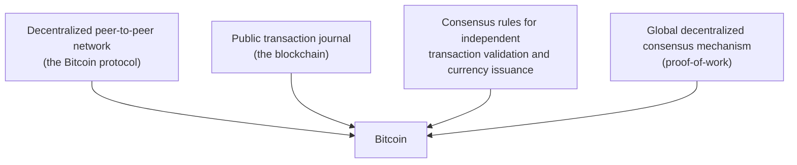
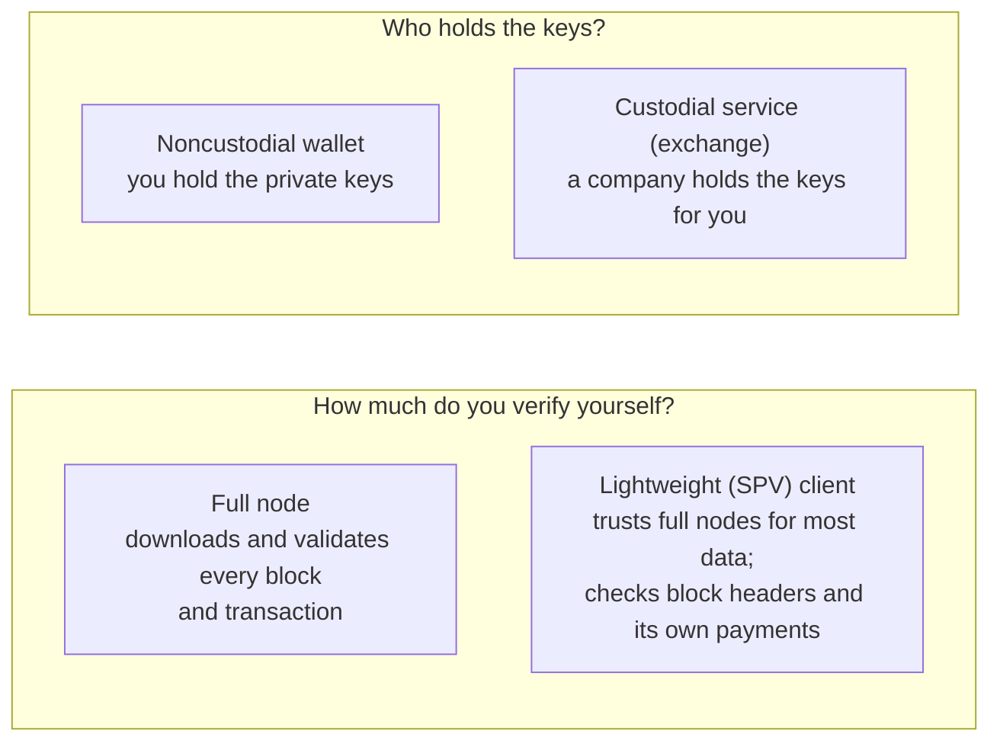

# Chapter 1 — Introduction

> One-line summary: Bitcoin is a collection of concepts and technologies (a protocol, a peer-to-peer network, and a currency) that lets strangers agree on who owns what without a central authority.

## At a glance

- **What it is:** a decentralized digital money system. "Bitcoin" (capital B) is the system and protocol; "bitcoin" (lower-case b) is the currency unit.
- **Who made it:** the pseudonymous Satoshi Nakamoto published the white paper *Bitcoin: A Peer-to-Peer Electronic Cash System* in **2008**; the network launched in **January 2009**.
- **Supply:** newly created bitcoin enters through mining on a fixed schedule; the total is capped at just under **21 million**.
- **Smallest unit:** 1 **satoshi** = 0.00000001 BTC (one hundred-millionth).
- **No accounts, no balances on file:** ownership is proven with digital signatures over transaction outputs (details in chapter 2).

## The four innovations Bitcoin combined

The book stresses that none of the building blocks were new; the combination was.

Memorise the four: **network, ledger (blockchain), consensus rules, proof-of-work consensus**.

## Digital money's hard problems

| Problem | Why it is hard | Bitcoin's answer |
|---|---|---|
| Is the money authentic? | Digital data is trivially copied | Every unit traces back to a block reward; transactions are signed |
| Double spending | The same digital coin could be sent to two people | One agreed public ledger; the proof-of-work chain orders transactions |
| Who is in charge? | Central issuers can censor, inflate, or fail | Rules enforced by every node; nobody can change them alone |

## Kinds of wallets and nodes

- **Full node**: maximum independence; verifies the consensus rules itself.
- **Lightweight / SPV wallet**: fits on a phone; relies on full nodes for most information.
- **Noncustodial**: you control the keys, so you control the funds ("not your keys, not your coins").
- **Custodial**: convenient, but you are trusting a third party exactly as you would trust a bank.

## Alice's first bitcoin (the book's running example)

1. Alice installs a wallet app; it creates her **keys** and shows an **address**.
2. She gets bitcoin from a friend (Joe) who scans her address and sends a small amount.
3. Her wallet sees the **transaction** on the network almost immediately and shows it as unconfirmed.
4. Within about ten minutes a miner includes it in a **block**: the first **confirmation**.
5. She later pays Bob's café; the same steps run in reverse (chapter 2 follows that payment in detail).

## Common misconceptions the quiz likes to test

- Bitcoin is **not** a company, and Satoshi Nakamoto does **not** control it.
- Bitcoin is **not anonymous**; it is pseudonymous. Every transaction is public.
- The blockchain does **not** store account balances; it stores transactions whose outputs are either spent or unspent.
- **Bitcoin Core** is the reference implementation of the software, not "the" Bitcoin.

## Terms to know

Bitcoin, bitcoin (unit), satoshi, blockchain, proof-of-work, consensus rules, full node, lightweight (SPV) client, custodial vs noncustodial wallet, double spending, Satoshi Nakamoto, Bitcoin Core.
