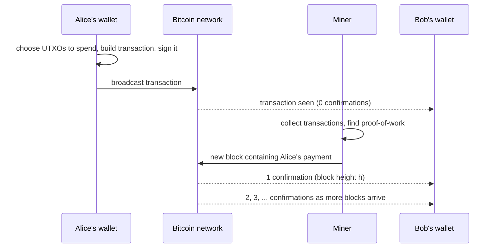
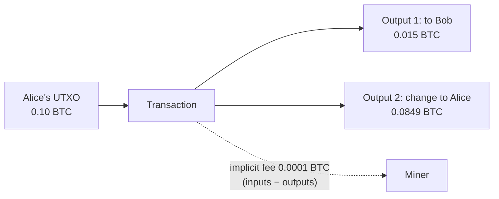
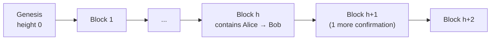

# Chapter 2 — How Bitcoin Works

> One-line summary: bitcoin moves as transactions that consume **unspent transaction outputs (UTXOs)** and create new ones; miners bundle transactions into blocks roughly every ten minutes, and each later block makes a payment harder to reverse.

## The running example: Alice buys coffee from Bob

## Transactions: inputs and outputs

- A **transaction** has **inputs** (references to earlier outputs it spends) and **outputs** (new amounts locked to new conditions).
- A **UTXO** is an output that has not been spent yet. Your "balance" is just the sum of the UTXOs your keys can unlock.
- UTXOs are **indivisible**: you must consume a whole output. If it is bigger than the payment you make **change** back to yourself as an extra output.
- **Fee** = total inputs − total outputs. There is no explicit fee field; whatever is not assigned to an output goes to the miner.

- Outputs carry an **output script** (the lock: e.g. "whoever can sign with the key for this address"). Inputs supply an **input script / witness** (the key: e.g. the signature) that satisfies the earlier output's lock.
- Transactions form a **chain**: each input points to a previous transaction's output; follow the chain back and every coin ends at a block reward (coinbase) transaction.

### Common transaction shapes

| Shape | Inputs → outputs | Typical use |
|---|---|---|
| Simple payment | 1 → 2 | pay someone and receive change |
| Aggregating | many → 1 | consolidate small coins |
| Distributing | 1 → many | payroll, exchanges paying withdrawals |

## Blocks, mining and confirmations

- Nodes relay transactions; **miners** collect them into a candidate **block**.
- **Proof-of-work**: the miner repeatedly changes a nonce and hashes the block header until the hash is below the network **target**. The **difficulty** retargets every 2016 blocks so blocks arrive about every **10 minutes** on average.
- The winning miner earns the **block reward**: the **block subsidy** (new bitcoin; halves every 210,000 blocks, about every four years) plus all **fees** in the block.
- A transaction in the newest block has **1 confirmation**; each block built on top adds one. Reversing a payment requires redoing the proof-of-work of every block after it, so risk falls quickly. Six confirmations is a common rule of thumb for large amounts; a café can accept zero-confirmation payments for a coffee.
- **Block height** counts blocks from the **genesis block** (height 0).

## Spending the coffee payment onward

Bob can immediately use the UTXO Alice created as an input to pay his suppliers. Nothing "settles" into an account; ownership simply passes from output to output, transaction to transaction.

## Common misconceptions the quiz likes to test

- Wallets do **not** hold coins; they hold **keys**. Coins are outputs recorded on the blockchain.
- A fee is **not** a separate field; it is the **difference** between inputs and outputs.
- "Unconfirmed" does not mean invalid; it means "not yet in a block".
- Miners do **not** "solve useful math problems"; they perform brute-force hashing to find a header hash under the target.

## Terms to know

Transaction, input, output, UTXO, change, fee, output script, input script (witness), block, block header, mining, proof-of-work, nonce, target, difficulty, block reward, block subsidy, coinbase transaction, confirmation, block height, genesis block.
